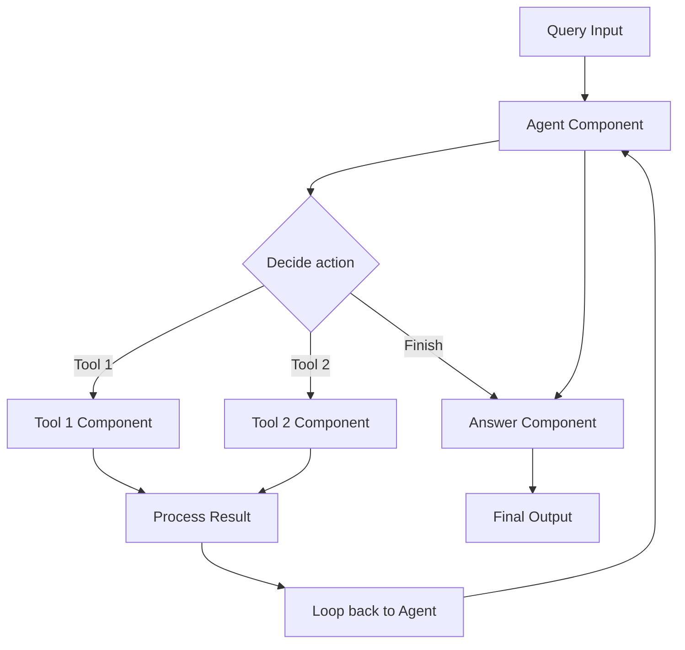

**Category:** AI Agent Development Frameworks
**Difficulty:** Intermediate
**Reading time:** 6 min read

---

Haystack pipelines provide a declarative framework for building agent workflows by composing components into directed acyclic graphs. Agents in Haystack leverage this pipeline infrastructure to coordinate tool calls, data flow, and decision logic in a modular, maintainable architecture.

- **Pipeline** — Directed acyclic graph of components and connections
- **Component** — Modular processing unit with inputs and outputs
- **Connection** — Data flow between components
- **Routing** — Conditional branching based on component outputs
- **Loop** — Iterative component execution within pipelines
- **Document store** — Persistent storage for retrieved documents
- **Agent component** — Component that coordinates tool selection and invocation

Haystack pipelines define workflows declaratively by specifying components and their connections. An agent component sits at the center, receiving the current query/context and deciding which tool to invoke. Each tool is represented as a component with inputs (parameters) and outputs (results). The agent's output is routed to the selected tool component, which executes and produces results. These results flow to a processing component, which formats them and feeds them back to the agent for the next iteration. Routing ensures only the selected tool executes, avoiding unnecessary computation. Pipelines can include loops, allowing the agent to iterate multiple times. Document stores persist retrieved data, making it available across pipeline runs. This declarative approach decouples agent logic from infrastructure concerns, making pipelines easy to visualize, test, and modify.

- Question-answering systems over documents
- Multi-tool orchestration workflows
- Search enhancement with retrieval and ranking
- Information extraction pipelines
- Research assistance systems
- Semantic search with post-processing
- Complex data processing workflows

| Advantage | Disadvantage |
|-----------|--------------|
| Declarative, easy to visualize | Learning curve for pipeline DSL |
| Modular components reusable across pipelines | Less flexible for complex custom logic |
| Built-in support for persistence | Configuration can become verbose |
| Type-safe component connections | Performance overhead from framework |
| Easy testing of individual components | Debugging distributed execution |

- [Haystack decision nodes](haystack-decision-nodes.md)
- [Haystack custom components](haystack-custom-components.md)
- [Agent evaluation frameworks](agent-evaluation-frameworks.md)

---
*Part of the [AI Agent Development Frameworks](index.md) category · [Back to Master Index](../../index.md)*
