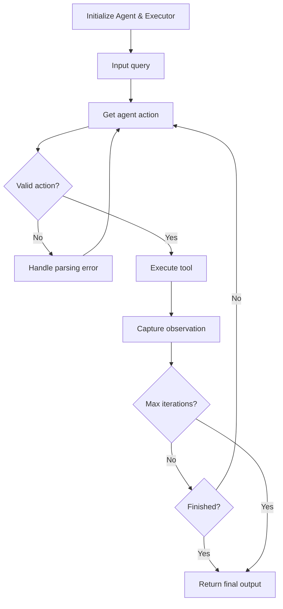

**Category:** AI Agent Development Frameworks
**Difficulty:** Intermediate
**Reading time:** 6 min read

---

Agent executors in LangChain are the runtime engines that manage the execution loop of agents. They handle initialization, tool invocation, error handling, and termination conditions, providing a robust framework for running agents in production while managing retries, token limits, and iteration boundaries.

- **Executor** — The runtime system that orchestrates agent logic and tool calls
- **Max iterations** — A safety limit on how many tool calls an agent can make
- **Timeout** — Duration limit for agent execution to prevent runaway processes
- **Return intermediate steps** — Option to expose all tool calls and observations
- **Handle parsing errors** — Graceful recovery when LLM output doesn't conform to expected format
- **Early stopping** — Terminating execution when the agent signals completion

The executor maintains the agent loop and enforces constraints. Upon initialization, it receives an agent instance and configuration parameters including max iterations and timeout values. When invoked with an input, the executor repeatedly calls the agent to determine the next action. For each action, it validates the format—if the LLM output doesn't parse correctly, it captures this as an error message and feeds it back to the agent for correction. Once a valid action is parsed, the executor locates and invokes the corresponding tool, capturing the result. The executor then checks termination conditions: whether max iterations have been reached, the timeout has expired, or the agent indicates task completion. If none apply, the loop continues. The executor maintains a history of all steps, optionally returning them for auditing or debugging. This abstraction decouples agent logic from execution management, allowing consistent, reproducible behavior across different agent configurations.

- Running agents with strict resource constraints
- Production systems requiring timeout and iteration limits
- Applications needing full audit trails of agent decisions
- Error recovery and graceful degradation
- Batching and parallel agent execution
- Testing and debugging agent behavior
- Monitoring and logging agent activity

| Advantage | Disadvantage |
|-----------|--------------|
| Prevents runaway execution with iteration limits | May cut off legitimate long-running tasks |
| Provides structured error handling | Timeout values must be tuned per task |
| Full visibility into agent steps | Overhead of tracking all intermediate results |
| Consistent behavior across environments | Complex configuration and initialization |
| Safety guarantees for production systems | Less flexible than direct agent invocation |

- [LangChain agents and tools](langchain-agents-and-tools.md)
- [LangChain agent memory types](langchain-agent-memory-types.md)
- [Agent evaluation frameworks](agent-evaluation-frameworks.md)

---
*Part of the [AI Agent Development Frameworks](index.md) category · [Back to Master Index](../../index.md)*
