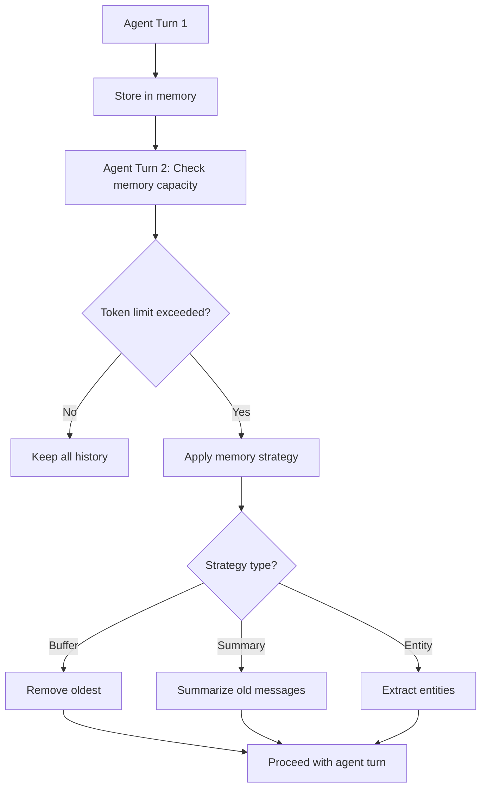

**Category:** AI Agent Development Frameworks
**Difficulty:** Intermediate
**Reading time:** 6 min read

---

LangChain offers multiple memory types for agents, each with different trade-offs between context preservation and token efficiency. Memory implementations range from simple buffering of all exchanges to sophisticated summarization and selective retention strategies, allowing developers to match memory behavior to application constraints.

- **Buffer memory** — Storing all interactions unmodified
- **Summary memory** — Summarizing old messages to preserve tokens
- **Entity memory** — Tracking entities and relationships across conversation
- **Knowledge graph memory** — Storing information as structured graphs
- **Window memory** — Retaining only recent messages
- **Context relevance** — Selecting memory based on query similarity
- **Memory persistence** — Saving memory to databases for recovery

Different memory types serve different purposes and constraints. BufferMemory simply appends all messages to a list, ideal for short conversations but problematic as they grow. SummaryMemory periodically uses the LLM to summarize earlier messages, preserving semantic meaning while reducing token count—useful for long conversations but adding latency and cost. EntityMemory extracts key entities and relationships, maintaining a structured knowledge of important elements discussed. ConversationKGMemory builds a knowledge graph, enabling sophisticated queries and relationship reasoning. Window memory keeps only the most recent N messages, ensuring bounded context size. Developers can also implement custom memory that retrieves relevant past messages based on semantic similarity to the current query, balancing completeness and efficiency. Most memory types support persistence to databases, enabling recovery across sessions and multi-user scenarios where conversation history needs to survive application restarts.

- Short-term conversations with limited history needs (BufferMemory)
- Long-running assistants requiring summarization (SummaryMemory)
- Applications needing structured entity tracking
- Knowledge-intensive domains benefiting from relationship tracking
- Systems with strict token budgets (WindowMemory)
- Multi-session applications requiring persistent memory
- Complex reasoning requiring past context recall

| Advantage | Disadvantage |
|-----------|--------------|
| BufferMemory: Simple, no information loss | Unbounded token growth |
| SummaryMemory: Preserves context efficiently | Summarization adds latency and cost |
| EntityMemory: Structured, queryable | Complex to maintain entity graphs |
| WindowMemory: Predictable token usage | Loses long-term context |
| Custom/semantic retrieval: Relevance-driven | Complex implementation and tuning |

- [LangChain conversational agents](langchain-conversational-agents.md)
- [LangChain agents and tools](langchain-agents-and-tools.md)
- [LangChain agent executors](langchain-agent-executors.md)

---
*Part of the [AI Agent Development Frameworks](index.md) category · [Back to Master Index](../../index.md)*
