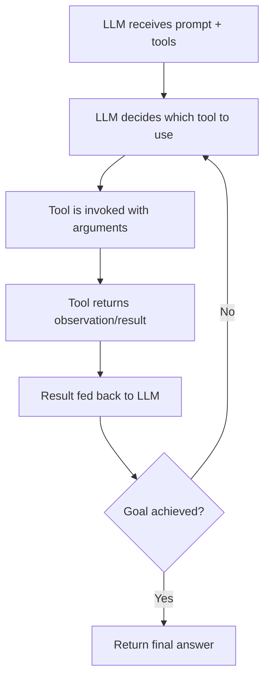

**Category:** AI Agent Development Frameworks
**Difficulty:** Intermediate
**Reading time:** 6 min read

---

LangChain agents are autonomous systems that use language models to determine which tools to invoke and in what sequence. They interpret model outputs to decide on actions, observe results, and iterate until reaching a goal—enabling dynamic, context-aware automation without predefined workflows.

- **Agent** — An autonomous system using an LLM to decide which tools to use and when
- **Tool** — A function or API that an agent can invoke to perform specific tasks
- **Tool schema** — Structured metadata describing what a tool does and what inputs it requires
- **Action/Observation loop** — The iterative process where an agent decides actions, executes them, and processes results
- **Prompt template** — Instructions guiding the agent on how to select and use available tools

LangChain agents leverage language models to bridge the gap between natural reasoning and executable actions. When initialized, an agent receives a prompt describing available tools along with their schemas. The LLM reads this context and reasons about which tool best solves the current problem. Once a tool is selected, the agent formats the call according to the tool's expected input, executes it, and captures the result. This observation is then appended to the conversation history, allowing the LLM to evaluate progress, determine if additional steps are needed, or refine its approach. The cycle continues until the agent decides the task is complete, at which point it returns a structured response. This design allows complex, multi-step tasks to be decomposed dynamically without hard-coding workflows, making agents adaptable to novel problems.

- Question-answering systems over documents or APIs
- Research and data gathering automation
- Decision support systems that reason through problems
- Task automation where steps depend on intermediate results
- Integration with external services (weather, stock prices, databases)
- Code generation and debugging assistance
- Automated report generation from multiple sources

| Advantage | Disadvantage |
|-----------|--------------|
| Flexible, adapts to new problems | May call tools unpredictably |
| Chains complex operations without manual orchestration | Higher latency due to multiple LLM calls |
| Easy to add new tools via schema | Expensive in terms of API calls and tokens |
| Interpretable reasoning loop | Prone to hallucination if tool descriptions are unclear |
| Works with any LLM that supports function calling | Requires careful prompt engineering |

- [LangChain agent executors](langchain-agent-executors.md)
- [LangChain ReAct agents](langchain-react-agents.md)
- [LangChain conversational agents](langchain-conversational-agents.md)

---
*Part of the [AI Agent Development Frameworks](index.md) category · [Back to Master Index](../../index.md)*
