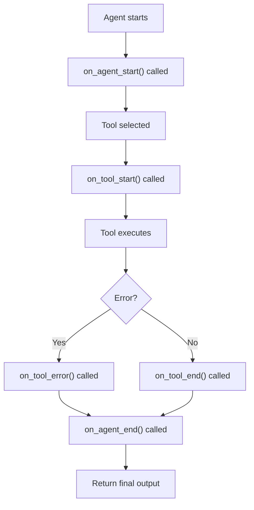

**Category:** AI Agent Development Frameworks
**Difficulty:** Intermediate
**Reading time:** 6 min read

---

Callback handlers in LangChain allow developers to hook into agent lifecycle events such as tool invocation, error handling, and step completion. These event listeners enable logging, monitoring, debugging, and custom side effects without modifying core agent logic, providing observability and extensibility.

- **Handler lifecycle events** — Callbacks at various agent execution stages
- **Start/end callbacks** — Executing code when tools start and finish
- **Error callbacks** — Handling exceptions during execution
- **Logging callbacks** — Recording activity for audit and debugging
- **Custom handlers** — User-defined callbacks for domain-specific operations
- **Handler composition** — Chaining multiple handlers for complex workflows
- **Async support** — Non-blocking callback execution

Agents accept a list of callback handlers during initialization. As the agent executes, it fires events at key points: when starting, when a tool is selected and about to execute, after the tool completes, if an error occurs, and when the agent finishes. Each handler can implement methods for the events it cares about—a logging handler might implement on_tool_start and on_tool_end, while a monitoring handler might only track on_agent_end. Handlers can be synchronous or asynchronous, allowing blocking operations like database writes or non-blocking operations like metrics publication. Multiple handlers can be attached to a single agent, enabling composition of concerns—logging, monitoring, error tracking, and custom business logic can all coexist. This design keeps agent code clean while enabling powerful extensibility; developers can add observability without touching the agent implementation.

- Production logging and audit trails
- Performance monitoring and metrics collection
- Real-time alerting on agent errors
- Cost tracking and budget enforcement
- User activity tracking and analytics
- Graceful shutdown and cleanup
- Custom domain-specific side effects
- Integration with external systems

| Advantage | Disadvantage |
|-----------|--------------|
| Non-invasive observability | Adds overhead if many handlers |
| Flexible composition of concerns | Callbacks add latency to execution |
| Easy to add/remove functionality | Complex async handler logic can be fragile |
| Audit trail without code modification | Handler failures can impact agent execution |
| Decouples logging from business logic | Debugging callback chains can be complex |

- [LangChain agent executors](langchain-agent-executors.md)
- [LangChain agents and tools](langchain-agents-and-tools.md)
- [Container monitoring tools](../container-technologies/container-monitoring-tools.md)

---
*Part of the [AI Agent Development Frameworks](index.md) category · [Back to Master Index](../../index.md)*
