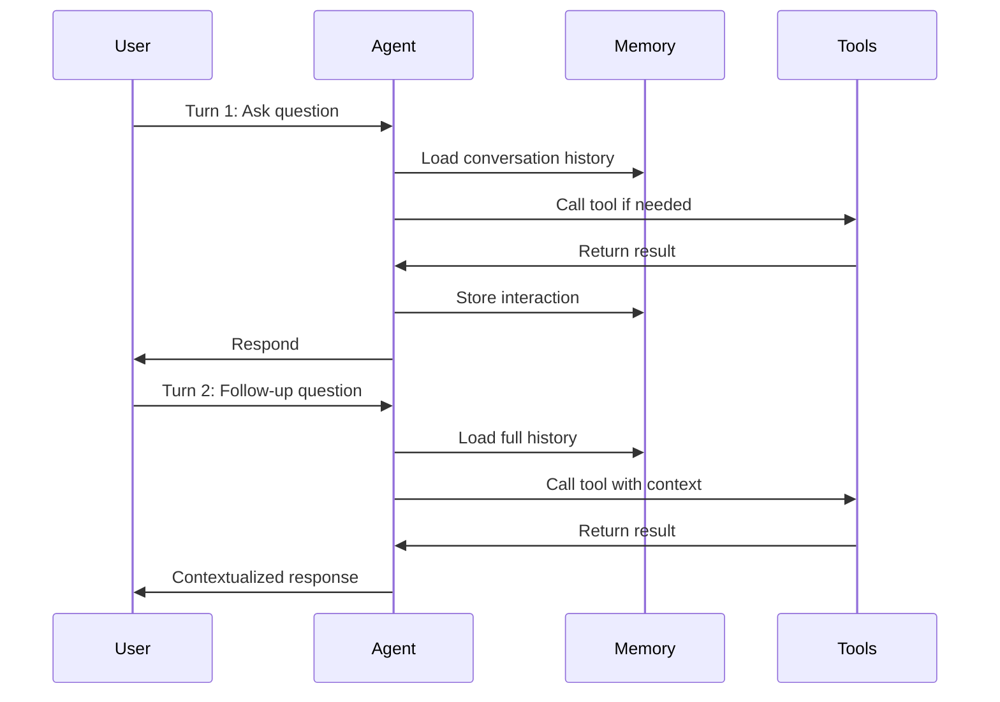

**Category:** AI Agent Development Frameworks
**Difficulty:** Intermediate
**Reading time:** 6 min read

---

Conversational agents in LangChain maintain dialogue state across multiple turns, enabling stateful interactions where the model remembers context and previous exchanges. They combine agent capabilities with conversation memory, allowing users to have natural, multi-turn interactions while the agent dynamically invokes tools based on the evolving conversation.

- **Conversation memory** — Maintaining dialogue history across turns
- **Chat history** — Sequential record of user and agent messages
- **Context window** — Available tokens for conversation and tools
- **Message role** — Distinguishing between user, assistant, and system messages
- **Turn-based interaction** — Sequential exchange of messages with state persistence
- **Stateful tool invocation** — Tools that understand prior context

Conversational agents initialize with a memory backend (e.g., ConversationBufferMemory, ConversationSummaryMemory) that stores all prior exchanges. On each user input, the agent retrieves this history and includes it in the prompt context. This enables the agent to understand references to previous discussion, maintain state across multiple tool calls, and build on earlier information. The agent uses its standard decision-making process to determine if tools are needed, but now has richer context for tool selection and parameter configuration. After responding, the agent appends the new exchange to memory for future turns. Memory backends can implement different strategies: storing all messages (buffering), summarizing older messages to preserve context while managing token usage, or maintaining only the most recent exchanges. This flexibility allows developers to balance conversational richness against token constraints.

- Customer support chatbots
- Research assistants in iterative investigations
- Personal productivity agents
- Data analysis systems requiring clarification
- Educational tutoring systems
- Interactive code generation and debugging
- Multi-turn question-answering systems

| Advantage | Disadvantage |
|-----------|--------------|
| Natural conversation flow | Memory grows and increases token costs |
| Context awareness across turns | Requires memory management strategy |
| User-friendly interaction model | Outdated memory can mislead the agent |
| Flexible memory implementations | Complex state management |
| Enables personalization over time | Privacy concerns with stored histories |

- [LangChain agents and tools](langchain-agents-and-tools.md)
- [LangChain agent memory types](langchain-agent-memory-types.md)
- [Rasa conversational AI agents](rasa-conversational-ai-agents.md)

---
*Part of the [AI Agent Development Frameworks](index.md) category · [Back to Master Index](../../index.md)*
