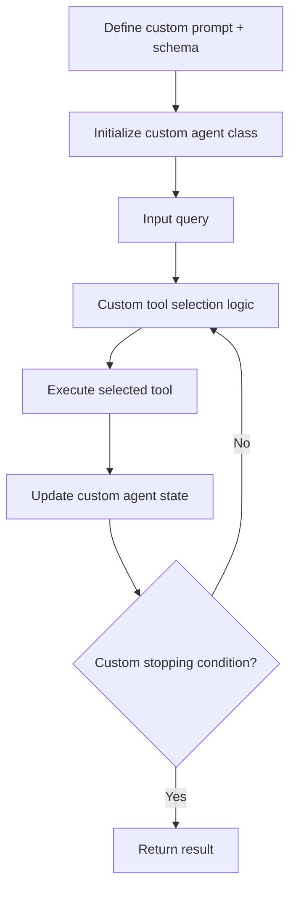

**Category:** AI Agent Development Frameworks
**Difficulty:** Intermediate
**Reading time:** 6 min read

---

Custom agent creation in LangChain allows developers to build agents beyond predefined templates by defining custom prompts, tool selection logic, and stopping conditions. This enables tailored agents optimized for specific domains, business logic, or novel agent architectures not covered by standard implementations.

- **Custom prompt template** — Domain-specific instructions for agent reasoning
- **Custom tool selection logic** — Algorithms beyond simple LLM-based selection
- **Stopping condition** — Custom rules determining when agent should halt
- **Action schema** — Defining how the agent specifies tool calls
- **Agent state** — Custom data structures tracking execution state
- **Routing logic** — Dynamic determination of which tools or sub-agents to invoke

Building a custom agent starts with defining a prompt template that encodes the specific reasoning style and tool descriptions needed for your domain. This prompt is typically more sophisticated than generic templates, incorporating domain vocabulary, examples, and heuristics. The custom agent class overrides the standard decision-making pipeline with bespoke logic—for instance, a tool selector might rank tools by relevance score, confidence threshold, or business rules rather than relying solely on the LLM. The agent state can be enriched with domain-specific data like user context, execution history, or cost tracking. Custom stopping conditions allow implementation of domain-specific termination logic—for instance, stopping when a confidence threshold is reached or after a specific business milestone. This flexibility comes with responsibility: developers must carefully design and test custom logic, as incorrect implementation can degrade agent performance or create unexpected behaviors.

- Specialized domains (finance, healthcare, legal) requiring domain-specific reasoning
- Multi-agent systems with sophisticated routing and delegation
- Cost-optimized agents that selectively use expensive tools
- Systems requiring custom logging, auditing, or compliance checks
- Agents integrating business logic or constraints
- Research and experimentation with novel agent architectures
- Performance-critical systems needing custom optimization

| Advantage | Disadvantage |
|-----------|--------------|
| Optimized for specific domains and use cases | Higher complexity and maintenance burden |
| Fine-grained control over agent behavior | More testing and debugging required |
| Integration of business logic and constraints | Reduced leverage from community tools and updates |
| Novel architectures and research flexibility | Steeper learning curve for the team |
| Better performance on specialized tasks | Risk of subtle bugs in custom logic |

- [LangChain agents and tools](langchain-agents-and-tools.md)
- [LangChain agent executors](langchain-agent-executors.md)
- [DSPy optimized agents](dspy-optimized-agents.md)

---
*Part of the [AI Agent Development Frameworks](index.md) category · [Back to Master Index](../../index.md)*
