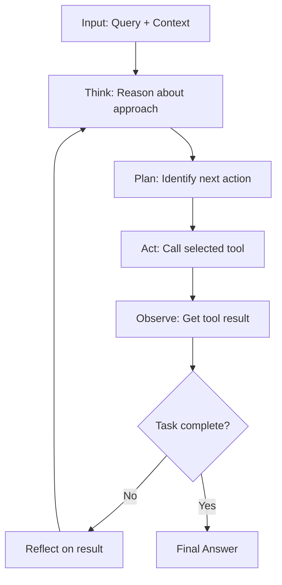

**Category:** AI Agent Development Frameworks
**Difficulty:** Intermediate
**Reading time:** 6 min read

---

ReAct (Reasoning + Acting) agents in LangChain interleave explicit reasoning with tool invocation. The agent articulates its thought process before taking actions, improving interpretability and decision quality. This prompting technique encourages the model to think step-by-step before committing to tool calls, reducing hallucinations and improving accuracy on complex tasks.

- **ReAct paradigm** — Combining reasoning and action in an alternating loop
- **Thought** — Explicit reasoning about the problem before selecting tools
- **Action** — A specific tool call with justified parameters
- **Observation** — The result returned by the tool
- **Reasoning transparency** — Making the agent's decision process visible and auditable
- **Chain-of-thought** — Encouraging multi-step reasoning before commitment

ReAct agents use specialized prompt templates that explicitly request reasoning before action. When the agent processes a query, it first generates a "Thought" section where it reasons about the problem, considers available tools, and plans its approach. Only after articulating this reasoning does it generate an "Action" section specifying which tool to call and with what parameters. The tool executes and returns an "Observation." The agent then reviews this observation and the overall progress, deciding whether to continue with additional thoughts and actions or provide a final answer. This structure forces the model to commit to explicit reasoning, which correlates with better accuracy and fewer hallucinations. The visible reasoning also makes the agent's decision-making process auditable, valuable for high-stakes applications. Effective ReAct prompts include few-shot examples demonstrating the desired format and reasoning quality.

- Complex multi-step reasoning tasks
- Financial analysis and research
- Code debugging and development
- Medical or legal research where reasoning is auditable
- Educational systems explaining problem-solving
- Quality-critical applications requiring high accuracy
- Tasks where understanding agent reasoning is important

| Advantage | Disadvantage |
|-----------|--------------|
| Improved accuracy through explicit reasoning | Longer prompts and more tokens per call |
| Better interpretability of agent decisions | Slower execution due to reasoning overhead |
| Reduced hallucinations | Requires careful prompt engineering |
| Auditable reasoning trail | Model must be capable of coherent reasoning |
| Works across different domains with similar templates | More expensive in terms of token usage |

- [LangChain agents and tools](langchain-agents-and-tools.md)
- [LangChain conversational agents](langchain-conversational-agents.md)
- [LangChain structured chat agents](langchain-structured-chat-agents.md)

---
*Part of the [AI Agent Development Frameworks](index.md) category · [Back to Master Index](../../index.md)*
