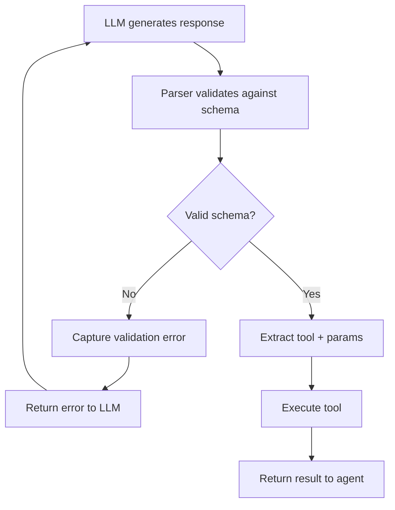

**Category:** AI Agent Development Frameworks
**Difficulty:** Intermediate
**Reading time:** 6 min read

---

Structured chat agents in LangChain enforce strict formatting of agent outputs using JSON or other structured schemas. They ensure reliable parsing of tool calls by requiring the model to produce valid, schema-compliant responses, improving robustness and reducing parsing errors in production systems.

- **Structured output** — Agent responses in predefined formats like JSON
- **Schema validation** — Checking output against expected structure before parsing
- **Output parser** — Component converting raw model output into structured objects
- **Reliable tool calling** — Guaranteed valid tool invocation regardless of model inconsistency
- **Type safety** — Enforced parameter types for tool calls
- **Error recovery** — Automatic retry with corrective feedback when parsing fails

Structured chat agents use specialized output parsers that enforce compliance with a predefined schema. The system initializes with a schema defining expected fields: the tool name, parameters, and any optional metadata. The agent prompt includes explicit instructions to format outputs according to this schema, often with examples. When the LLM generates a response, the parser attempts to extract and validate the structure. If the response violates the schema—missing fields, incorrect types, or syntax errors—the parser generates an error message that is fed back to the agent, prompting correction. This loop continues until valid output is produced or a retry limit is exceeded. The advantage is that the parser guarantees valid, executable tool calls, eliminating the ambiguity inherent in free-form text. This is particularly valuable for models that occasionally produce malformed output or when strict reliability is required.

- Production systems requiring error-free tool invocation
- APIs with strict parameter validation
- Systems with many available tools where mistakes are costly
- Automated workflows with minimal human oversight
- Real-time systems where parsing errors cause delays
- Applications requiring compliance or audit trails
- Hybrid human-AI systems where agent errors escalate to humans

| Advantage | Disadvantage |
|-----------|--------------|
| Guaranteed valid output format | Requires careful schema design |
| No ambiguity in parsing | More verbose prompts and examples needed |
| Reliable tool parameter extraction | Some models struggle with constraints |
| Automatic error recovery | Higher token usage for error messages |
| Easier downstream processing | Less flexibility in agent responses |

- [LangChain agents and tools](langchain-agents-and-tools.md)
- [LangChain conversational agents](langchain-conversational-agents.md)
- [LangChain agent executors](langchain-agent-executors.md)

---
*Part of the [AI Agent Development Frameworks](index.md) category · [Back to Master Index](../../index.md)*
