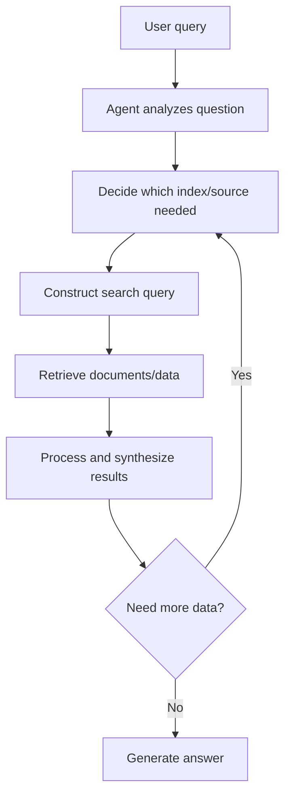

**Category:** AI Agent Development Frameworks
**Difficulty:** Intermediate
**Reading time:** 6 min read

---

LlamaIndex data agents are autonomous systems designed specifically for querying and analyzing structured and unstructured data. They leverage LlamaIndex's indexing and retrieval capabilities to dynamically construct queries, access multiple data sources, and synthesize information into comprehensive answers.

- **Data agent** — An agent specialized for data retrieval and analysis
- **Query construction** — Dynamically building queries based on agent reasoning
- **Index selection** — Choosing appropriate indexes or data sources
- **Tool-based retrieval** — Using retrieval tools as agent actions
- **Data synthesis** — Combining results from multiple sources
- **Structured knowledge** — Organizing data for efficient agent access
- **Query decomposition** — Breaking complex queries into retrieval steps

Data agents in LlamaIndex are built on top of LlamaIndex's retrieval infrastructure. They have access to multiple indexes (vector, keyword, knowledge graphs) and can decide which to query based on the input question. When initialized, the agent receives tool definitions for each available index along with their characteristics. Given a user question, the agent reasons about which data source is most relevant and constructs an appropriate query—a vector search for semantic similarity, a keyword search for specific terms, or a graph query for relationships. The retrieval tool executes and returns results, which the agent processes and synthesizes. For complex questions requiring multiple sources, the agent iterates, constructing successive queries to fill information gaps. This design allows natural, conversational interaction with complex datasets without requiring users to understand underlying data structures or query syntax.

- Document Q&A over large corpora
- Multi-source data analysis and reporting
- Research assistance combining documents and databases
- Customer service bots querying knowledge bases
- Business intelligence and analytics
- Compliance and audit systems
- Exploratory data analysis and discovery

| Advantage | Disadvantage |
|-----------|--------------|
| Handles multiple data sources transparently | Query construction errors can impact results |
| Natural language interface to structured data | Complex questions may require multiple iterations |
| Leverages LlamaIndex retrieval optimization | Latency from multiple retrieval calls |
| Flexible index selection and routing | Requires well-structured data and indexes |
| Reduces need for SQL or complex syntax | May retrieve irrelevant data if indexes are poor |

- [LlamaIndex query planning](llamaindex-query-planning.md)
- [LlamaIndex sub-question query engine](llamaindex-sub-question-query-engine.md)
- [LlamaIndex recursive retriever](llamaindex-recursive-retriever.md)

---
*Part of the [AI Agent Development Frameworks](index.md) category · [Back to Master Index](../../index.md)*
