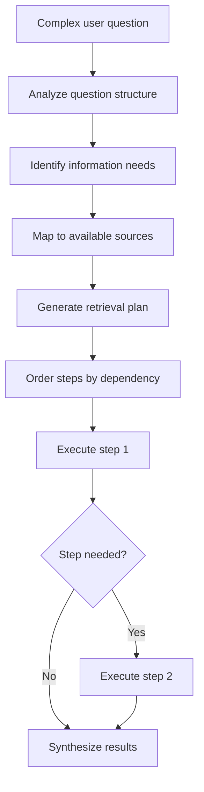

**Category:** AI Agent Development Frameworks
**Difficulty:** Intermediate
**Reading time:** 6 min read

---

Query planning in LlamaIndex involves breaking down complex user questions into structured retrieval steps. The system reasons about how to efficiently access available data sources, deciding which retrieval methods to use and in what sequence to gather necessary information for comprehensive answers.

- **Query plan** — Structured set of retrieval steps to answer a question
- **Step decomposition** — Breaking complex queries into simpler sub-queries
- **Dependency resolution** — Ordering steps based on information dependencies
- **Source selection** — Choosing which data sources each step queries
- **Optimization** — Minimizing retrieval calls while maintaining accuracy
- **Plan validation** — Checking if plans will likely answer the question
- **Adaptive planning** — Adjusting plans based on intermediate results

Query planning systems analyze incoming questions to understand what information is needed. The planner considers available data sources and their strengths—some indexes excel at semantic search, others at keyword matching, knowledge graphs at relationship queries. Based on this analysis, it constructs a plan specifying which retrieval method to use and in what order. The plan respects dependencies: if a later step needs results from an earlier one, steps are ordered appropriately. The plan is then executed step by step, with a system synthesizing intermediate results. If early steps don't provide sufficient information, the planner may adaptively generate additional steps. This approach is more efficient than traditional approaches where every question queries all sources, and more effective than simple rule-based routing by leveraging reasoning about question structure.

- Multi-document question answering
- Complex research queries over large corpora
- Business intelligence aggregating multiple data sources
- Customer support systems with diverse knowledge bases
- Cross-database analytical queries
- Document-based legal and compliance research
- Hierarchical data retrieval and analysis

| Advantage | Disadvantage |
|-----------|--------------|
| Efficient, avoids unnecessary queries | Plan generation adds latency |
| Can handle complex multi-step questions | Errors in planning cascade through execution |
| Reduces redundant retrievals | Requires understanding of data structure |
| Improves answer quality through targeted retrieval | Difficult to predict plan quality upfront |
| Leverages strengths of different retrieval methods | Complex planning logic to maintain |

- [LlamaIndex data agents](llamaindex-data-agents.md)
- [LlamaIndex sub-question query engine](llamaindex-sub-question-query-engine.md)
- [LlamaIndex recursive retriever](llamaindex-recursive-retriever.md)

---
*Part of the [AI Agent Development Frameworks](index.md) category · [Back to Master Index](../../index.md)*
