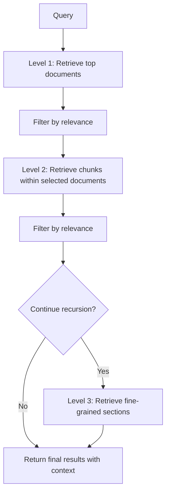

**Category:** AI Agent Development Frameworks
**Difficulty:** Intermediate
**Reading time:** 6 min read

---

The recursive retriever in LlamaIndex performs multi-level retrieval, starting with coarse-grained document retrieval and recursively drilling down into progressively finer-grained chunks. This hierarchical approach efficiently narrows the scope of search from broad documents to specific relevant passages.

- **Hierarchical retrieval** — Multi-level search from documents to chunks
- **Recursive refinement** — Progressive narrowing of search scope
- **Coarse-to-fine search** — Starting broad, becoming more specific
- **Relevance filtering** — Eliminating irrelevant branches early
- **Depth control** — Limiting recursion to manage latency and cost
- **Context preservation** — Maintaining document context in fine-grained results
- **Efficiency gains** — Avoiding exhaustive search of all chunks

Recursive retrieval begins with an initial broad search, typically retrieving top documents or document summaries. These candidates are scored for relevance, with low-scoring items filtered out. The retriever then "zooms in" on remaining candidates, retrieving chunks or sections within them. These chunks are again scored, with the process repeating at subsequent levels. At each level, filtering reduces the number of candidates proceeding to the next level, creating an inverted pyramid of increasing specificity. The depth of recursion is configurable—deeper recursion finds more precise matches but increases latency and cost. The final results include both the specific chunks and their parent documents, preserving context. This approach is much more efficient than naively retrieving and scoring all chunks upfront, as it prunes large irrelevant portions of the document tree early.

- Large document collections requiring precise passage retrieval
- Hierarchically organized knowledge bases (books → chapters → sections)
- Legal and compliance document research
- Technical documentation Q&A
- Academic paper retrieval and citation analysis
- Multi-level code repository search
- Complex domain-specific knowledge systems

| Advantage | Disadvantage |
|-----------|--------------|
| Efficient filtering reduces irrelevant results | Recursion depth must be tuned |
| Preserves document context | Multi-level queries add latency |
| Scales well to large document sets | Early filtering can miss relevant results |
| Flexible depth configuration | Complex configuration and tuning |
| Better precision than flat retrieval | Requires well-structured document hierarchy |

- [LlamaIndex data agents](llamaindex-data-agents.md)
- [LlamaIndex query planning](llamaindex-query-planning.md)
- [LlamaIndex sub-question query engine](llamaindex-sub-question-query-engine.md)

---
*Part of the [AI Agent Development Frameworks](index.md) category · [Back to Master Index](../../index.md)*
