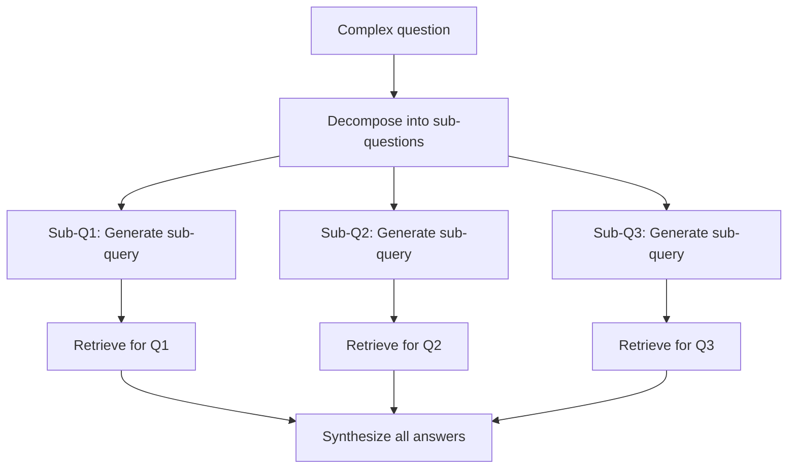

**Category:** AI Agent Development Frameworks
**Difficulty:** Intermediate
**Reading time:** 6 min read

---

The sub-question query engine in LlamaIndex automatically decomposes complex questions into simpler sub-questions, retrieves information for each, and synthesizes comprehensive answers. This approach handles multi-faceted questions by addressing each aspect independently before integrating results.

- **Question decomposition** — Splitting complex questions into components
- **Sub-question generation** — Creating focused, answerable sub-queries
- **Parallel retrieval** — Executing multiple sub-questions concurrently
- **Result synthesis** — Combining sub-answers into coherent responses
- **Question dependency** — Understanding relationships between sub-questions
- **Coverage validation** — Ensuring all question aspects are addressed
- **Answer integration** — Merging potentially overlapping or conflicting information

The sub-question query engine uses an LLM to analyze a complex question and identify its component parts. For instance, a question like "What are the main differences between solar and wind energy in terms of efficiency, cost, and environmental impact?" is decomposed into sub-questions like "What is the efficiency of solar energy?", "What is the efficiency of wind energy?", etc. Each sub-question is sufficiently focused that it can be answered by a single retrieval call. The engine generates queries for each sub-question and executes them in parallel, improving performance. As results return, a synthesis component integrates them, ensuring the final answer addresses each aspect of the original question. This decomposition approach is particularly effective for comparative questions, multi-faceted topics, and scenarios where no single retrieval can fully answer the query. The engine handles potential conflicts—if sub-answers contradict, the synthesis component flags or reconciles them.

- Comparative analysis questions
- Multi-factor decision questions
- Questions requiring multiple document sources
- Research synthesizing diverse perspectives
- Comprehensive product/service reviews
- Cross-domain analysis
- Complex technical documentation queries

| Advantage | Disadvantage |
|-----------|--------------|
| Handles complex multi-faceted questions well | Decomposition can be imperfect or biased |
| Parallel retrieval improves latency | More complex than single-step retrieval |
| Better coverage of question aspects | Integration errors can produce confusing answers |
| Clearer breakdown of reasoning | Requires LLM-based decomposition |
| Facilitates auditing of answer generation | Cost of multiple retrieval calls |

- [LlamaIndex data agents](llamaindex-data-agents.md)
- [LlamaIndex query planning](llamaindex-query-planning.md)
- [LlamaIndex recursive retriever](llamaindex-recursive-retriever.md)

---
*Part of the [AI Agent Development Frameworks](index.md) category · [Back to Master Index](../../index.md)*
