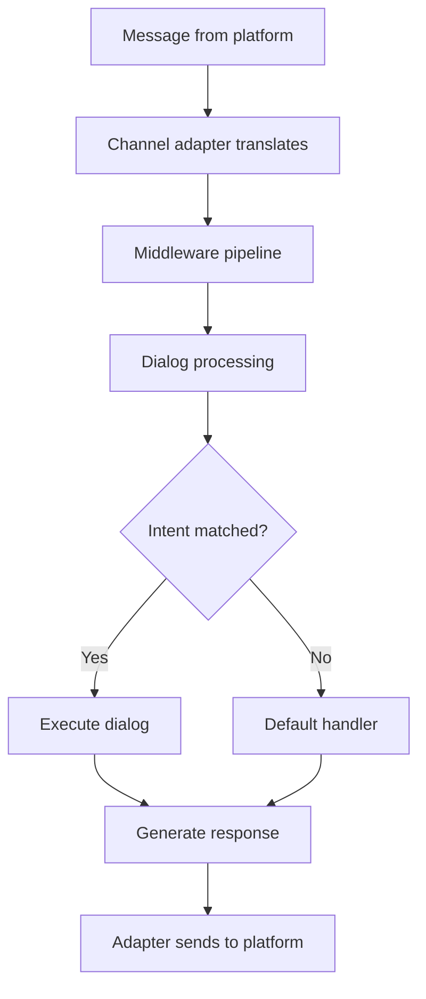

**Category:** AI Agent Development Frameworks
**Difficulty:** Intermediate
**Reading time:** 6 min read

---

Microsoft Bot Framework is a comprehensive SDK and platform for building intelligent bots. It provides SDKs for .NET and JavaScript, middleware ecosystem, and integration with Azure services, enabling enterprise bot development with strong tooling and governance.

- **Bot adapter** — Handles protocol translation between platforms
- **Activity** — Message, event, or interaction unit
- **Middleware** — Extensible processing pipeline
- **State management** — Conversation and user state persistence
- **Dialog** — Modular conversation component
- **Recognizer** — Intent recognition (NLU integration)
- **Channel** — Platform connector (Teams, Slack, etc.)

Bots built with Bot Framework inherit from the Activity Handler class. Messages flow through a middleware pipeline where each middleware can inspect and modify the activity. Dialog components handle conversation logic, enabling multi-turn interactions. Recognizers (often LUIS or QnA Maker) extract intent from user messages. Dialogs can be hierarchical and stateful, maintaining context across turns. State management middleware persists user and conversation state to storage (memory, blob storage, Cosmos DB). The adapter handles translation between the bot's internal format and platform-specific protocols, allowing the same bot code to run on Teams, Slack, or web channels. Governance features include activity logging, authentication, and deployment to Azure for enterprise security.

- Enterprise chatbots with governance requirements
- Microsoft Teams integrated bots
- Multi-platform conversational systems
- Complex state-managed conversations
- Systems requiring .NET ecosystem integration
- Organizations standardized on Microsoft cloud
- Bots with sophisticated dialogue flows

| Advantage | Disadvantage |
|-----------|--------------|
| Comprehensive SDK and tooling | Microsoft/.NET ecosystem bias |
| Strong middleware and extensibility | Learning curve for framework |
| Enterprise governance features | More complex than simple frameworks |
| Azure integration seamless | Overkill for simple use cases |
| Active development and community | Vendor lock-in to Microsoft services |

- [Dialogflow agent builder](dialogflow-agent-builder.md)
- [Amazon Lex conversational bots](amazon-lex-conversational-bots.md)
- [Voiceflow agent design](voiceflow-agent-design.md)

---
*Part of the [AI Agent Development Frameworks](index.md) category · [Back to Master Index](../../index.md)*
