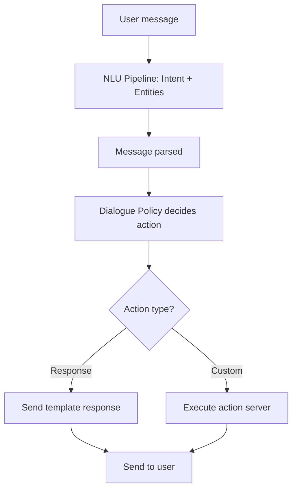

**Category:** AI Agent Development Frameworks
**Difficulty:** Intermediate
**Reading time:** 6 min read

---

Rasa is an open-source conversational AI framework enabling building of dialogue systems without external dependencies. It combines NLU for intent/entity recognition, dialogue management for conversation flow, and action servers for integration with external tools and services.

- **Intent** — User message category or goal
- **Entity** — Extracted information from user input
- **Dialogue state** — Current conversation context
- **Story** — Conversational flow example
- **Action** — Custom code executed during conversation
- **Slot** — Stored conversation information
- **Policy** — Decision-making component for response selection

Rasa processes user messages through an NLU pipeline that identifies intent (what the user wants) and extracts entities (relevant information). These are passed to the dialogue management layer, which maintains conversation state in slots and decides what action to take next. Policies are trained on example conversations (stories) and learn when to respond with template responses or invoke custom actions. Custom actions can query databases, call APIs, or perform complex logic, returning data to be incorporated into responses. Stories in Rasa describe example conversation flows, showing intent → action → response sequences. The framework handles context tracking, enabling natural multi-turn conversations. Unlike pure LLM-based systems, Rasa provides explicit control over dialogue flow while still supporting learning from data.

- Task-oriented chatbots
- Customer service automation
- Internal assistant systems
- Form-filling and information gathering bots
- Multilingual conversation systems
- Systems requiring explicit dialogue control
- Privacy-focused conversational AI (no external APIs)

| Advantage | Disadvantage |
|-----------|--------------|
| Open source, no vendor lock-in | Requires dialogue design and training data |
| Explicit dialogue control | Less natural than pure LLM approaches |
| Integrates custom business logic easily | Learning curve for framework |
| Good for task-oriented systems | Limited free-form conversation capabilities |
| Strong community and documentation | Maintenance burden for custom logic |

- [Rasa NLU and dialogue management](rasa-nlu-and-dialogue-management.md)
- [LangChain conversational agents](langchain-conversational-agents.md)
- [Botpress conversational agents](botpress-conversational-agents.md)

---
*Part of the [AI Agent Development Frameworks](index.md) category · [Back to Master Index](../../index.md)*
