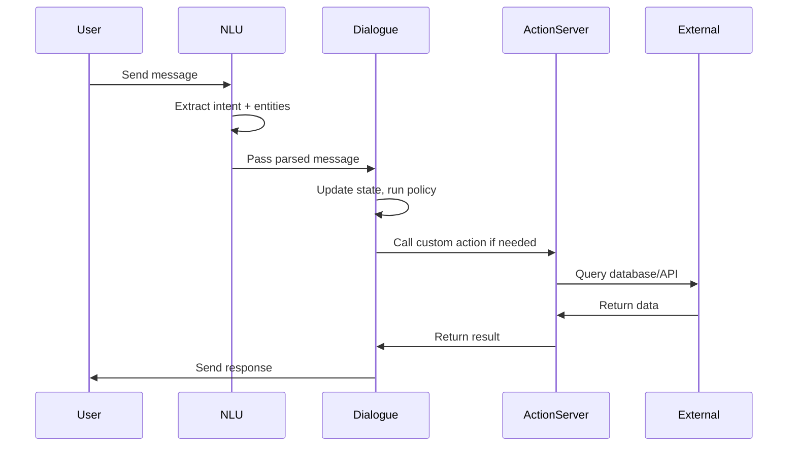

**Category:** AI Agent Development Frameworks
**Difficulty:** Intermediate
**Reading time:** 6 min read

---

Rasa NLU (Natural Language Understanding) extracts intent and entities from user messages, while Rasa dialogue management maintains conversation state and selects appropriate responses. Together, they form a complete conversational AI system combining language understanding with context-aware dialogue flow.

- **NLU pipeline** — Multi-stage processing of user text
- **Intent classification** — Determining user's goal from message
- **Entity extraction** — Identifying relevant information
- **Featurization** — Converting text to numerical features
- **Dialogue state tracker** — Maintaining conversation context
- **Policy learning** — Training decision-making from stories
- **Slot filling** — Collecting required information

Rasa NLU begins by preprocessing text—tokenizing, lowercasing, and featurizing into numerical representations. Multiple intent classifiers and entity extractors run in parallel, producing confidence scores. The highest-confidence predictions are selected. NLU handles misspellings, synonyms, and context through data augmentation and dense features. The dialogue management system receives this parsed input and updates the conversation state: it stores any extracted entities in slots and evaluates its learned policy to decide the next action. Policies are trained on stories—example conversations showing what action should follow each intent/state combination. If the policy selects a custom action, it invokes an action server which can query databases or external APIs. The response is selected from templates, optionally personalizing with extracted information. The framework supports complex dialogue flows including clarification requests, form filling, and context-dependent responses.

- Conversation understanding and parsing
- Intent-based command systems
- Information extraction from chat
- Multi-turn form-filling dialogues
- Context-dependent conversation logic
- Multilingual NLU systems
- Dialogue state tracking and persistence

| Advantage | Disadvantage |
|-----------|--------------|
| Interpretable intent/entity extraction | Requires training data labeled with intents |
| Explicit dialogue control through policies | Limited free-form conversation |
| Handles context through slots | Requires dialogue design effort |
| Integrates external actions easily | Less flexible than pure LLM approaches |
| Good at task completion | Performance depends on training quality |

- [Rasa conversational AI agents](rasa-conversational-ai-agents.md)
- [LangChain conversational agents](langchain-conversational-agents.md)
- [Dialogflow agent builder](dialogflow-agent-builder.md)

---
*Part of the [AI Agent Development Frameworks](index.md) category · [Back to Master Index](../../index.md)*
