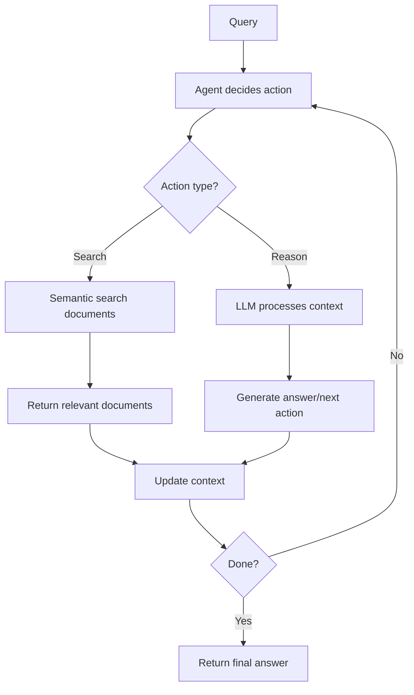

**Category:** AI Agent Development Frameworks
**Difficulty:** Intermediate
**Reading time:** 6 min read

---

txtai is a lightweight RAG framework enabling agent workflows through SQL-like queries on documents combined with LLM reasoning. Agents in txtai leverage semantic search and local model execution to build efficient, self-contained systems without external API dependencies.

- **RAG framework** — Retrieval-augmented generation system
- **Semantic search** — Vector similarity for document retrieval
- **SQL-like queries** — Structured document retrieval with filter/sort
- **LLM integration** — Local model execution for reasoning
- **Lightweight architecture** — Minimal dependencies and resource requirements
- **Agent action flow** — Sequential reasoning and document retrieval
- **Embeddings** — Vector representations for semantic matching

txtai agents operate on a document database indexed with semantic vectors. When an agent needs information, it formulates a search query and uses semantic similarity to find relevant documents. The search is precise and efficient, powered by txtai's optimized indexing. Retrieved documents are combined with the agent's current context and reasoning prompt, allowing the LLM to make informed decisions. The agent can then decide to search for more information, invoke tools, or provide an answer. All processing can happen locally, making txtai suitable for privacy-sensitive applications and edge deployment. The framework's lightweight nature makes it ideal for resource-constrained environments while still supporting sophisticated agent workflows.

- Privacy-sensitive agent systems (no external API calls)
- Embedded AI agents in applications
- Edge deployment of agent systems
- Knowledge base Q&A
- Document-heavy agent tasks
- Low-latency agent systems
- Cost-conscious agent deployment

| Advantage | Disadvantage |
|-----------|--------------|
| Lightweight, minimal dependencies | Limited to document-based reasoning |
| Local execution, privacy-friendly | Smaller community and fewer integrations |
| Efficient semantic search | Model quality limited to available local models |
| Cost-effective at scale | Less feature-rich than larger frameworks |
| Easy to embed in applications | Requires managing local embeddings index |

- [LlamaIndex data agents](llamaindex-data-agents.md)
- [LangChain agents and tools](langchain-agents-and-tools.md)
- [Vector database deployment patterns](../vector-database-infrastructure/vector-database-deployment-patterns.md)

---
*Part of the [AI Agent Development Frameworks](index.md) category · [Back to Master Index](../../index.md)*
