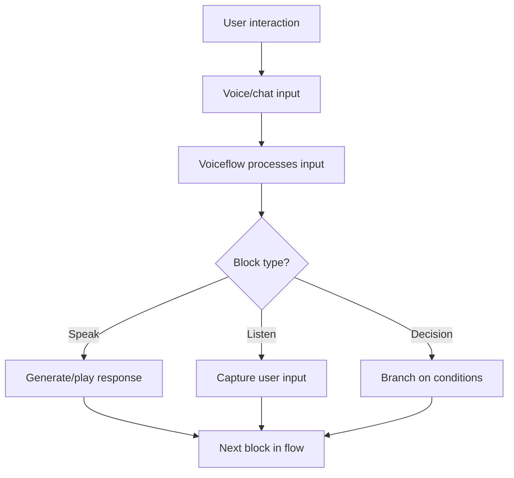

**Category:** AI Agent Development Frameworks
**Difficulty:** Intermediate
**Reading time:** 6 min read

---

Voiceflow is a visual designer for voice and chat agents, enabling non-technical users to build conversational experiences. It combines visual design, AI capabilities, and direct integration with voice platforms and messaging services, streamlining agent development and deployment.

- **Canvas** — Visual conversation flow design space
- **Block** — Functional unit (speak, listen, decision)
- **Variable** — Conversation state and data storage
- **Intent** — User goal recognition
- **AI response** — LLM-powered generative responses
- **Integration** — API/webhook connections
- **Publishing** — Deployment to platforms

Voiceflow provides a drag-and-drop canvas where designers build agent flows by connecting blocks. Blocks represent actions: speaking (text or dynamic responses), listening (capturing user input), decisions (conditional branching), or integrations (calling APIs). Variables store conversation state and user information, persisted across turns. When publishing, Voiceflow transpiles the visual design into executable code. Direct integrations with Alexa, Google Assistant, Slack, and web platforms handle platform-specific concerns. The Voiceflow Studio enables real-time testing and iteration. AI responses enable natural language generation without templating—Voiceflow can generate contextually appropriate responses using LLMs. This visual approach makes agent design accessible to non-technical team members while retaining sophistication through integrations and custom logic.

- Voice app development for Alexa and Google Assistant
- Customer service chatbots
- Product demos and interactive experiences
- Internal workflow automation
- Education and training interactions
- Brand engagement and marketing bots
- Rapid prototyping of conversational experiences

| Advantage | Disadvantage |
|-----------|--------------|
| Visual design accessible to non-coders | Platform vendor lock-in |
| Rapid prototyping and iteration | Less control than code-based approaches |
| Direct platform integrations | Pricing scales with usage |
| Collaboration features for teams | Learning curve for complex flows |
| Built-in testing and debugging | Export capabilities limited |

- [Botpress conversational agents](botpress-conversational-agents.md)
- [Dialogflow agent builder](dialogflow-agent-builder.md)
- [Microsoft Bot Framework](microsoft-bot-framework.md)

---
*Part of the [AI Agent Development Frameworks](index.md) category · [Back to Master Index](../../index.md)*
