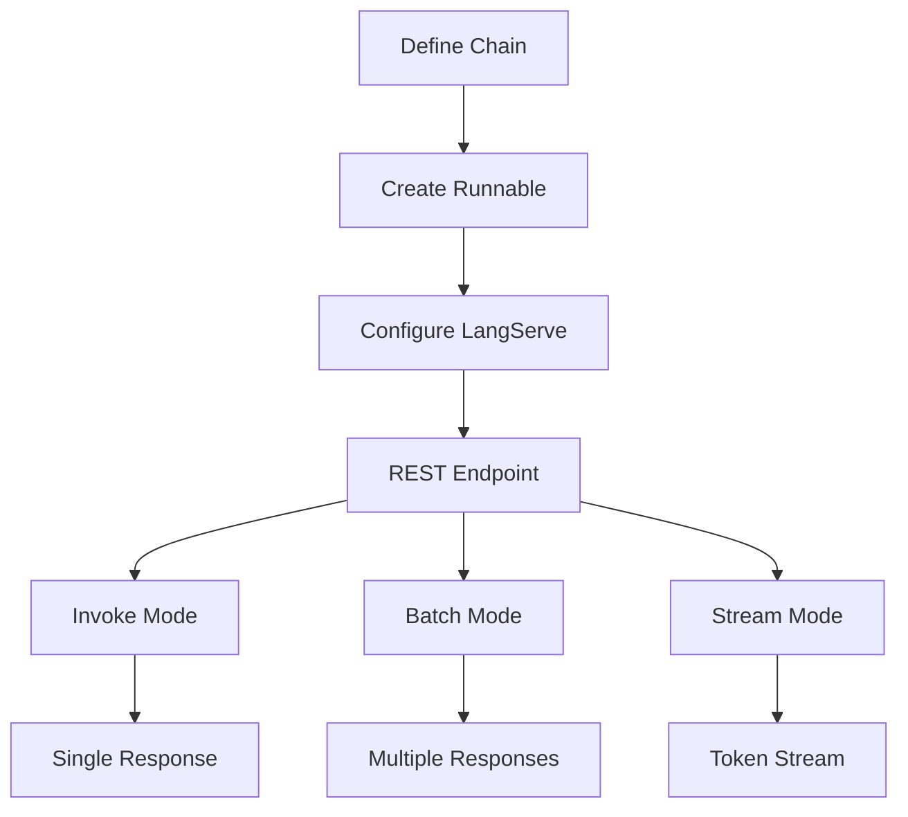

**Category:** AI Agent Hosting & Deployment
**Difficulty:** Intermediate
**Reading time:** 6 min read

---

LangServe is LangChain's production serving framework, enabling deployment of chains and agents as REST APIs. It handles request parsing, response formatting, and provides built-in support for complex agent workflows.

- **Chain serving** — Exposing LangChain chains as API endpoints
- **REST API generation** — Automatic API creation from chain definitions
- **Request validation** — Type checking and input validation
- **Streaming responses** — Server-sent events for token-by-token responses
- **Invoke/batch/stream** — Multiple execution modes for different use cases

LangServe sits on top of LangChain's Runnable interface, which standardizes how chains and agents are executed. You define your agent or chain using LangChain components. LangServe wraps the runnable and exposes three execution modes through HTTP: invoke (single request), batch (multiple requests), and stream (token streaming). Each endpoint automatically handles serialization of inputs and outputs. Requests are validated against the runnable's input schema. Streaming responses use Server-Sent Events for real-time delivery of tokens. LangServe integrates with LangSmith for tracing and monitoring. You can deploy LangServe applications using standard frameworks like FastAPI.

- Serving LangChain agents as production APIs
- Building chatbot APIs with streaming responses
- Providing batch processing endpoints
- Enabling token-streaming for better UX
- Deploying complex reasoning chains

| Advantage | Disadvantage |
|-----------|--------------|
| Tight LangChain integration | Limited to LangChain ecosystem |
| Automatic API generation saves time | Requires understanding Runnable interface |
| Support for streaming responses | Less control over API customization |
| Built-in monitoring integration | Additional abstraction layer |
| Straightforward deployment process | Performance overhead from framework |

- [LangServe FastAPI integration](langserve-fastapi-integration.md)
- [LangSmith agent deployment](langsmith-agent-deployment.md)
- [Modal serverless agent deployment](modal-serverless-agent-deployment.md)

---
*Part of the [AI Agent Hosting & Deployment](index.md) category · [Back to Master Index](../../index.md)*
