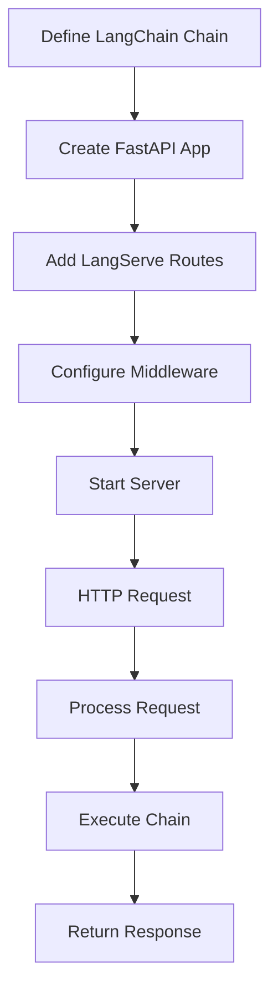

**Category:** AI Agent Hosting & Deployment
**Difficulty:** Intermediate
**Reading time:** 6 min read

---

LangServe integrates with FastAPI to provide a complete web framework for serving LangChain chains. FastAPI handles HTTP semantics while LangServe focuses on chain execution and integration.

- **FastAPI compatibility** — Built on top of FastAPI for web serving
- **Async execution** — Non-blocking request handling for high concurrency
- **OpenAPI documentation** — Automatic API documentation generation
- **Custom routes** — Ability to add custom endpoints beyond chain serving
- **Middleware support** — Authentication and custom request processing

LangServe extends FastAPI with methods to add chain routes. You create a FastAPI application and add LangServe routes that wrap your chains. LangServe automatically creates multiple endpoint variants for each chain (invoke, batch, stream). FastAPI handles HTTP request/response handling, while LangServe orchestrates chain execution. Async/await patterns ensure efficient handling of concurrent requests. You can add custom FastAPI routes for authentication, webhooks, or other features. OpenAPI documentation is automatically generated from chain input/output schemas. Middleware can add custom request processing like authentication or logging.

- Building production-ready chain APIs
- Adding custom endpoints to chain serving
- Implementing authentication and rate limiting
- Creating multi-endpoint applications combining chains and services
- Deploying agents with custom business logic

| Advantage | Disadvantage |
|-----------|--------------|
| Full web framework flexibility with FastAPI | More complex than simple chain serving |
| Async request handling for concurrency | Requires FastAPI knowledge |
| Can mix custom endpoints with chains | Less abstraction than pure LangServe |
| Middleware for authentication and logging | Setup complexity for simple deployments |
| Open standard HTTP APIs | Learning curve for async patterns |

- [LangChain LangServe deployment](langchain-langserve-deployment.md)
- [Steamship agent hosting platform](steamship-agent-hosting-platform.md)
- [Modal serverless agent deployment](modal-serverless-agent-deployment.md)

---
*Part of the [AI Agent Hosting & Deployment](index.md) category · [Back to Master Index](../../index.md)*
