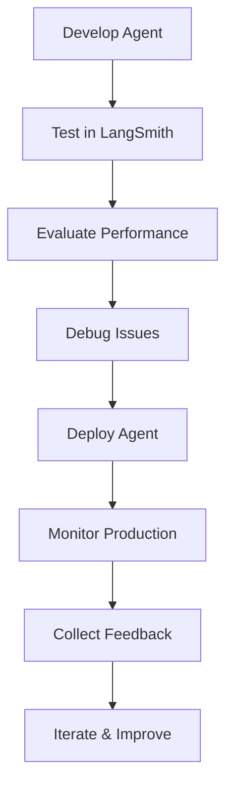

**Category:** AI Agent Hosting & Deployment
**Difficulty:** Intermediate
**Reading time:** 6 min read

---

LangSmith is a development and deployment platform for LLM applications. It provides tools for monitoring, debugging, and deploying language model agents with built-in observability and governance features.

- **Agent deployment** — Production serving of LangChain agents
- **Tracing and monitoring** — Complete visibility into agent execution
- **Evaluation** — Testing agents against datasets and benchmarks
- **Version control** — Managing agent versions and configurations
- **Governance** — Access control and usage tracking

LangSmith provides development tools integrated with the LangChain framework. You develop agents using LangChain, and LangSmith captures execution traces showing all LLM calls, tool invocations, and decisions. This visibility helps debug unexpected behaviors. The platform supports evaluating agents against test datasets to measure performance. When deploying, LangSmith handles agent serving with built-in scaling and monitoring. Production traces continue to be collected, enabling debugging of production issues. You can version agent configurations and gradually roll out updates. LangSmith provides governance features for access control and cost tracking.

- Deploying LangChain agents to production
- Monitoring agent performance and costs
- Evaluating agent quality before deployment
- Debugging production agent issues
- A/B testing different agent configurations

| Advantage | Disadvantage |
|-----------|--------------|
| Deep integration with LangChain ecosystem | Requires LangChain-based agents |
| Excellent debugging and tracing capabilities | Additional infrastructure cost |
| Built-in evaluation framework | Learning curve for platform |
| Version control for agent configurations | Potential vendor lock-in |
| Production monitoring enabled by default | Limited to LangChain-compatible agents |

- [LangSmith monitoring and tracing](langsmith-monitoring-and-tracing.md)
- [LangChain LangServe deployment](langchain-langserve-deployment.md)
- [Agent monitoring and logging](agent-monitoring-and-logging.md)

---
*Part of the [AI Agent Hosting & Deployment](index.md) category · [Back to Master Index](../../index.md)*
