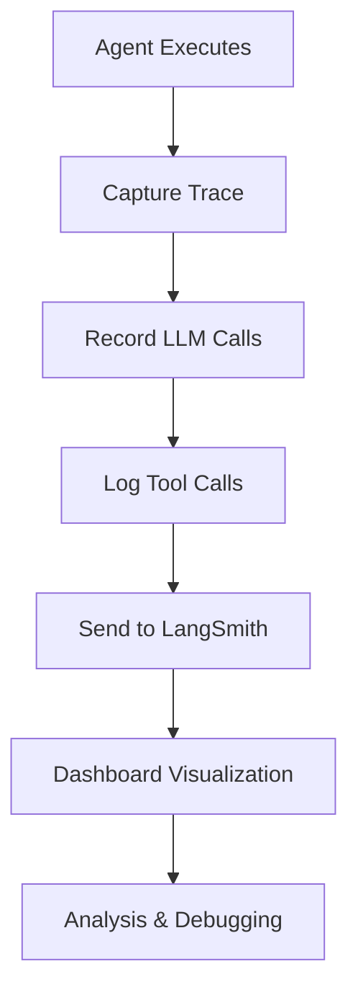

**Category:** AI Agent Hosting & Deployment
**Difficulty:** Intermediate
**Reading time:** 6 min read

---

LangSmith's monitoring and tracing capabilities provide complete visibility into LLM application execution. Every LLM call, tool invocation, and decision is captured and visualized for debugging and optimization.

- **Request tracing** — Complete execution flow for each user interaction
- **Cost tracking** — Monitoring API costs across agents and models
- **Performance metrics** — Latency and token usage measurement
- **Error tracking** — Identifying and debugging failures
- **Feedback capture** — User feedback integration for improvement

When an agent executes with LangSmith tracing enabled, every operation is captured. LLM API calls include prompts, completions, and token counts. Tool invocations record inputs and outputs. Traces are hierarchical, showing the parent-child relationships between calls. Complete traces are sent to LangSmith servers for storage and analysis. The LangSmith dashboard displays traces with timelines, inputs/outputs, and cost calculations. You can filter traces by various criteria and drill into individual operations. Traces link to captured feedback when users rate or provide input on results. Historical analysis shows trends in performance, costs, and errors over time.

- Debugging unexpected agent behavior
- Identifying expensive API calls
- Monitoring agent quality and performance
- Capturing user feedback for improvement
- Analyzing error patterns and root causes

| Advantage | Disadvantage |
|-----------|--------------|
| Complete visibility into execution | Network latency sending traces |
| Helps identify performance bottlenecks | Privacy considerations with trace storage |
| Cost tracking enables optimization | Additional infrastructure dependencies |
| Supports debugging production issues | Trace volume can be large |
| User feedback integration enabled | Requires trace data retention |

- [LangSmith agent deployment](langsmith-agent-deployment.md)
- [Agent monitoring and logging](agent-monitoring-and-logging.md)
- [Agent cost tracking](agent-cost-tracking.md)

---
*Part of the [AI Agent Hosting & Deployment](index.md) category · [Back to Master Index](../../index.md)*
