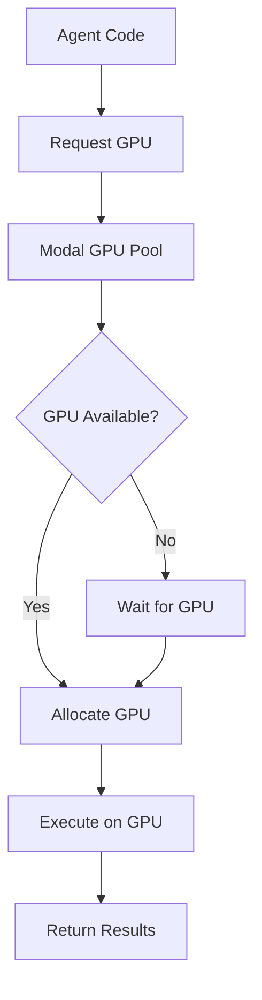

**Category:** AI Agent Hosting & Deployment
**Difficulty:** Intermediate
**Reading time:** 6 min read

---

Modal provides flexible GPU access for agent workloads, allowing agents to leverage GPU acceleration for inference and computation. This enables fast processing of large models without managing GPU infrastructure.

- **GPU selection** — Choose from various GPU types for different workloads
- **GPU pools** — Shared GPU resources for cost efficiency
- **Exclusive access** — Dedicated GPU allocation for consistent performance
- **Multi-GPU support** — Parallel processing across multiple GPUs
- **CUDA integration** — Native CUDA support for GPU compute

When you configure a Modal function to use GPUs, you specify the GPU type and quantity. Modal maintains pools of GPUs across its infrastructure. When your agent code executes, Modal allocates the specified GPUs from available pools. If GPUs are busy, requests queue until resources become available. Your agent code can use standard GPU frameworks like PyTorch, TensorFlow, or CUDA directly. NVIDIA's CUDA is pre-installed on GPU instances. Multiple agents can share GPUs through time-slicing or you can request exclusive GPU allocation. GPU allocation duration is billed separately from compute time.

- Running large language models for inference
- Accelerating image generation or processing
- GPU-intensive agent computations
- Distributed GPU workloads across agents
- Cost-effective GPU utilization through sharing

| Advantage | Disadvantage |
|-----------|--------------|
| Flexible GPU allocation without management | GPU wait times during high demand |
| Access to latest GPU hardware | Costs scale with GPU tier and duration |
| Shared pools reduce per-agent costs | Limited GPU type options |
| Easy multi-GPU scaling | Performance variability from sharing |
| CUDA tooling pre-installed | Cold startup for GPU-heavy agents |

- [Modal serverless agent deployment](modal-serverless-agent-deployment.md)
- [RunPod serverless GPU pods](../ai-model-hosting-platforms/runpod-serverless-gpu-pods.md)
- [Beam cloud serverless GPU](../ai-model-hosting-platforms/beam-cloud-serverless-gpu.md)

---
*Part of the [AI Agent Hosting & Deployment](index.md) category · [Back to Master Index](../../index.md)*
