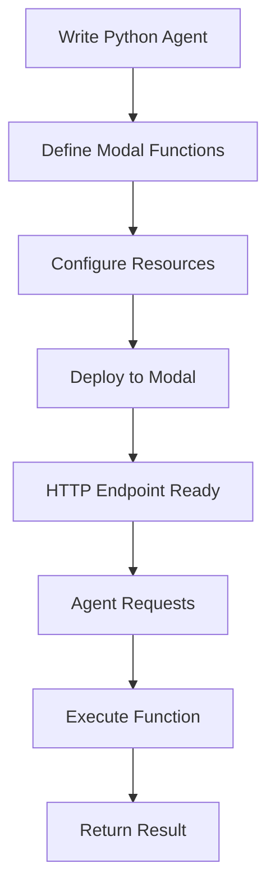

**Category:** AI Agent Hosting & Deployment
**Difficulty:** Intermediate
**Reading time:** 6 min read

---

Modal is a serverless computing platform optimized for Python applications including AI agents. It provides simple deployment of long-running agents and inference workloads with automatic scaling and no infrastructure management.

- **Python-native deployment** — Deploy Python directly without containers
- **Serverless execution** — No infrastructure management required
- **GPU support** — Access to GPUs for inference and training
- **Persistent storage** — Ability to mount volumes for data
- **Async execution** — Background jobs and scheduled tasks

With Modal, you write agents using standard Python and decorate functions with Modal decorators. Modal handles converting your code into serverless functions. When you deploy, Modal pushes your code and dependencies to its infrastructure. Functions are executed on-demand with specified resources (CPU, GPU, memory). Modal manages scaling, load balancing, and auto-shutdown of idle functions. Persistent storage can be mounted to maintain state or access large datasets. You can call Modal functions from external code or trigger them via HTTP endpoints. Async support enables background tasks and scheduled jobs for agent operations.

- Serving AI agents as serverless HTTP endpoints
- Background agent tasks triggered by events
- Long-running inference workloads
- GPU-accelerated agent processing
- Cost-effective agent deployment

| Advantage | Disadvantage |
|-----------|--------------|
| Simple Python-native deployment | Cold starts on first invocation |
| No container/Docker knowledge needed | Less control over environment |
| Integrated GPU access | Limited monitoring tools |
| Easy scaling without configuration | Vendor lock-in to Modal |
| Cost-effective for variable workloads | Performance varies by infrastructure |

- [Modal GPU access for agents](modal-gpu-access-for-agents.md)
- [RunPod serverless GPU agents](runpod-serverless-gpu-agents.md)
- [Google Cloud Functions](../cloud-platforms/google-cloud-functions.md)

---
*Part of the [AI Agent Hosting & Deployment](index.md) category · [Back to Master Index](../../index.md)*
