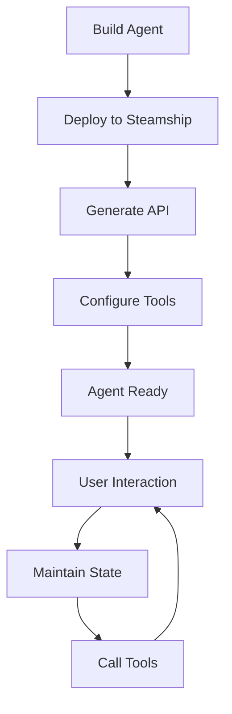

**Category:** AI Agent Hosting & Deployment
**Difficulty:** Intermediate
**Reading time:** 6 min read

---

Steamship's agent hosting platform provides infrastructure and abstractions for deploying conversational AI agents. It handles scaling, state management, and integration with multiple LLM providers.

- **Agent framework** — Standardized abstractions for agent development
- **State persistence** — Multi-turn conversation management
- **Tool integration** — Easy connection to external APIs
- **Multi-LLM support** — Switch between different language models
- **Auto-scaling** — Handles concurrent user sessions

Steamship provides Python decorators and classes for building agents. You define agent logic with tool specifications and memory strategy. Steamship handles the complexity of deploying agents at scale including request routing, session management, and state persistence. Each user interaction maintains independent conversation history and memory. Tools are invoked automatically based on agent decisions. The platform manages authentication, logging, and monitoring. You can switch between different LLM providers (OpenAI, Cohere, etc.) without code changes. Agents scale automatically to handle concurrent users.

- Building conversational agents with persistent memory
- Multi-turn dialogue systems with tool access
- Customer support chatbots
- Personal AI assistants
- Research agents with information access

| Advantage | Disadvantage |
|-----------|--------------|
| Handles agent infrastructure complexity | Requires Steamship framework adoption |
| Built-in state and memory management | Less flexibility than custom implementations |
| Automatic scaling for concurrent users | Learning curve for framework |
| Multi-LLM provider support | Platform-specific patterns |
| Straightforward tool integration | Potential vendor lock-in |

- [Steamship agent packages](steamship-agent-packages.md)
- [Steamship model packaging](../ai-model-hosting-platforms/steamship-model-packaging.md)
- [Chainlit conversational AI UI](chainlit-conversational-ai-ui.md)

---
*Part of the [AI Agent Hosting & Deployment](index.md) category · [Back to Master Index](../../index.md)*
