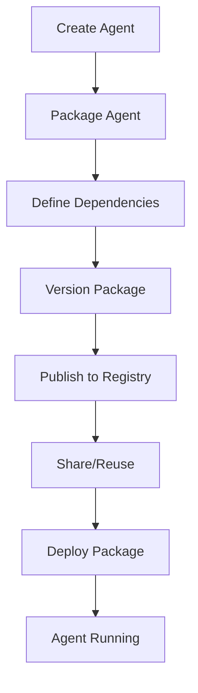

**Category:** AI Agent Hosting & Deployment
**Difficulty:** Intermediate
**Reading time:** 6 min read

---

Steamship agent packages enable sharing and reusing agent configurations across projects. Packages provide versioning, dependency management, and standardized deployment of complex agent systems.

- **Package management** — Reusable agent configurations as packages
- **Dependency handling** — Automatic resolution of agent dependencies
- **Version control** — Managing multiple package versions
- **Marketplace** — Community agent packages for common tasks
- **Template library** — Pre-built agent templates

Steamship packages contain agent definitions, dependencies, and configuration. You define packages using Steamship's package format which specifies agent components, tools, and dependencies. Packages can depend on other packages, creating composable agent systems. Version management allows publishing multiple versions and tracking compatibility. The Steamship package registry stores packages and enables discovery. Deployment of a package automatically resolves and installs dependencies. You can override package configuration at deployment time while maintaining reproducibility.

- Sharing agent configurations across teams
- Building libraries of reusable agents
- Contributing to community agent marketplace
- Composing complex agents from simpler components
- Standardizing agent deployment across organization

| Advantage | Disadvantage |
|-----------|--------------|
| Enables code reuse across projects | Additional abstraction layer |
| Version control for agent stability | Requires package maintenance |
| Community marketplace for discovery | Learning package management |
| Dependency resolution automation | Platform-specific package format |
| Simplifies team collaboration | Potential compatibility issues |

- [Steamship agent hosting platform](steamship-agent-hosting-platform.md)
- [BentoML agent packaging](bentoml-agent-packaging.md)
- [Agent version control](agent-version-control.md)

---
*Part of the [AI Agent Hosting & Deployment](index.md) category · [Back to Master Index](../../index.md)*
