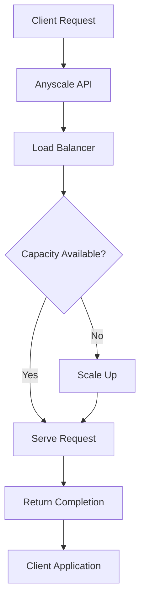

**Category:** AI Model Hosting Platforms
**Difficulty:** Intermediate
**Reading time:** 6 min read

---

Anyscale Endpoints is a managed inference service providing LLM serving with automatic scaling and cost optimization. It offers an OpenAI-compatible API for easy integration with existing applications.

- **OpenAI-compatible API** — Drop-in replacement for OpenAI API
- **Multiple model support** — Access to various open-source language models
- **Auto-scaling** — Automatic adjustment based on request volume
- **Token-based pricing** — Transparent per-token costs
- **Prompt caching** — Optimization for repeated requests

Anyscale Endpoints uses Ray Serve internally to manage model serving infrastructure. When you create an endpoint, Anyscale provisions Ray serving infrastructure and loads your selected model. The endpoint exposes an OpenAI-compatible API, making it trivial to migrate from OpenAI. Requests are load-balanced across available replicas. Anyscale automatically scales replicas based on request queue depth and latency. Prompt caching optimizes repeated requests to the same prompt prefix. Billing is transparent and based on input and output tokens. You can configure endpoint sizing, model selection, and scaling policies.

- Cost-effective LLM API alternative to OpenAI
- Self-hosted model serving with managed infrastructure
- Applications requiring specific model selection
- Organizations wanting model control and privacy
- Multi-model endpoints for experimentation

| Advantage | Disadvantage |
|-----------|--------------|
| OpenAI API compatibility simplifies migration | Performance may vary vs. OpenAI |
| More cost-effective than closed APIs | Dependent on Anyscale availability |
| Full control over model selection | Less model variety than OpenAI |
| Automatic scaling without management | Deployment adds complexity vs. API |
| Prompt caching provides optimization | Technical overhead vs. managed service |

- [Anyscale Ray platform](anyscale-ray-platform.md)
- [Ray Serve model serving](ray-serve-model-serving.md)
- [Together.ai inference platform](togetherai-inference-platform.md)

---
*Part of the [AI Model Hosting Platforms](index.md) category · [Back to Master Index](../../index.md)*
