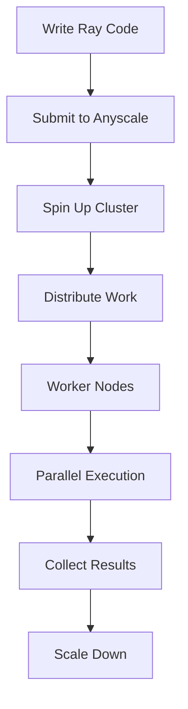

**Category:** AI Model Hosting Platforms
**Difficulty:** Advanced
**Reading time:** 7 min read

---

Anyscale's managed Ray platform provides distributed computing infrastructure for machine learning workloads. It simplifies scaling ML training, serving, and batch processing across multiple machines without cluster management complexity.

- **Distributed computing** — Scaling workloads across machine clusters
- **Ray framework** — Open-source distributed compute abstraction
- **Managed service** — Cloud-hosted Ray clusters with automatic scaling
- **Multi-framework support** — Works with TensorFlow, PyTorch, Scikit-learn
- **Cost optimization** — Spot instances and auto-shutdown of idle clusters

Anyscale manages Ray clusters on your behalf, handling provisioning, scaling, and teardown. You write code using Ray's distributed computing APIs for data processing, model training, or serving. When you submit a job, Anyscale provisions a cluster matching resource requirements. Ray distributes your computation across cluster nodes, automatically handling data movement and fault tolerance. Anyscale uses spot instances for cost optimization and scales clusters based on job requirements. You can configure cluster auto-shutdown to avoid idle charges. The platform provides job monitoring, logging, and cost tracking through a web dashboard.

- Distributed model training across GPUs
- Hyperparameter tuning with parallel trials
- Large-scale batch inference
- Real-time model serving with Ray Serve
- Distributed data processing pipelines

| Advantage | Disadvantage |
|-----------|--------------|
| Simplified cluster management | Requires learning Ray programming model |
| Automatic scaling based on workload | Potential latency from cluster provisioning |
| Cost optimization with spot instances | Complex debugging in distributed systems |
| Support for diverse ML frameworks | Limited to workloads compatible with Ray |
| Fault tolerance built-in | Overkill for simple single-machine tasks |

- [Anyscale Endpoints](anyscale-endpoints.md)
- [Ray Serve model serving](ray-serve-model-serving.md)
- [Ray Train distributed training](ray-train-distributed-training.md)

---
*Part of the [AI Model Hosting Platforms](index.md) category · [Back to Master Index](../../index.md)*
