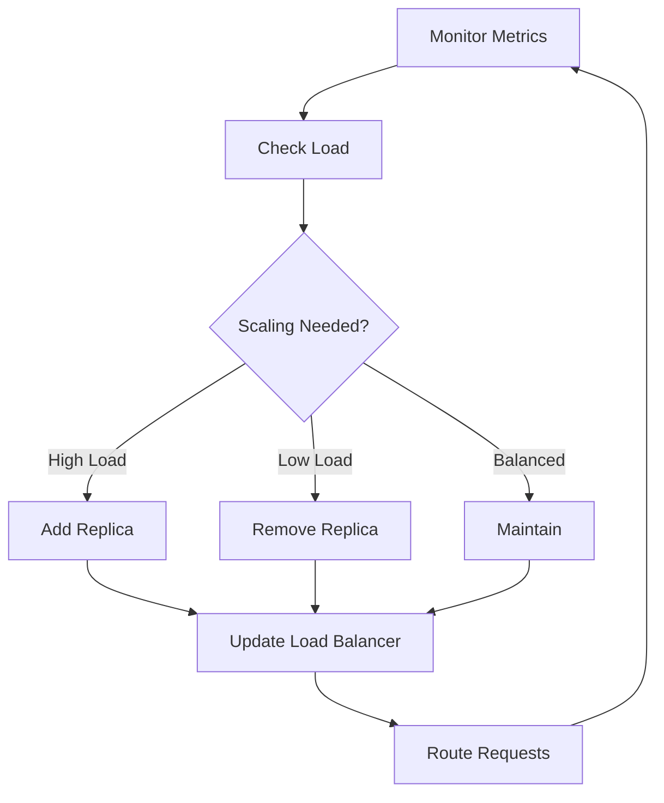

**Category:** AI Model Hosting Platforms
**Difficulty:** Intermediate
**Reading time:** 6 min read

---

Baseten's autoscaling system automatically adjusts the number of running model replicas based on incoming traffic and system metrics. This ensures optimal performance during traffic spikes while maintaining cost efficiency during quiet periods.

- **Horizontal scaling** — Adding or removing model instances based on load
- **Metrics-driven** — Scaling decisions based on latency, CPU, GPU utilization
- **Min/max replicas** — Configuration bounds for scaling behavior
- **Scale-up policy** — Rules for when to add new replicas
- **Scale-down policy** — Rules for when to remove unused replicas

Baseten continuously monitors system metrics including request queue depth, average latency, and resource utilization. When metrics indicate insufficient capacity, the platform automatically provisions additional model replicas. Each new replica requires time to initialize, so scaling decisions factor in expected load trends. Similarly, when load decreases and replicas remain underutilized, Baseten gradually removes excess capacity. You configure minimum and maximum replica counts to bound scaling behavior. The platform uses predictive scaling when possible to preemptively add capacity before latency degrades. Scaling decisions are made multiple times per minute to respond quickly to traffic changes.

- Handling traffic spikes in production services
- Managing variable demand throughout the day
- Cost optimization by scaling down during off-peak hours
- Maintaining SLAs during unexpected traffic surges
- Processing batch jobs with variable workload

| Advantage | Disadvantage |
|-----------|--------------|
| Automatic response to traffic changes | Scaling decisions may add latency |
| Cost savings from scaling down idle replicas | Cold starts when scaling up |
| Prevents overload and maintains SLAs | Complex behavior during demand fluctuations |
| Hands-off scaling management | May over-provision during traffic spikes |
| Configured thresholds allow tuning | Requires monitoring and optimization |

- [Baseten model serving platform](baseten-model-serving-platform.md)
- [Baseten model monitoring](baseten-model-monitoring.md)
- [Cloud cost optimization](../cloud-platforms/cloud-cost-optimization.md)

---
*Part of the [AI Model Hosting Platforms](index.md) category · [Back to Master Index](../../index.md)*
