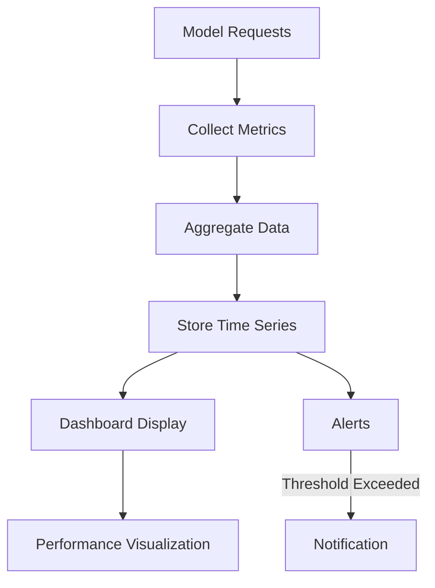

**Category:** AI Model Hosting Platforms
**Difficulty:** Intermediate
**Reading time:** 6 min read

---

Baseten provides comprehensive monitoring and observability tools for production models, tracking metrics like latency, throughput, error rates, and resource utilization. These insights enable teams to identify performance issues and optimize deployments proactively.

- **Performance metrics** — Latency, throughput, error rates, GPU utilization
- **Request logging** — Detailed tracking of individual prediction requests
- **Alerting** — Notifications when metrics exceed configured thresholds
- **Custom metrics** — Ability to track domain-specific metrics
- **Historical analysis** — Trending and comparison across time periods

Every request to a Baseten model generates monitoring data including request timestamp, latency, input/output tokens, error status, and resource utilization. Baseten aggregates this data into time series metrics and stores it for historical analysis. The monitoring dashboard displays real-time metrics and historical trends across configurable time windows. You can drill down into individual requests to understand latency sources or debug issues. Custom metrics can be reported from your model code for domain-specific monitoring. Alerts trigger when metrics cross configured thresholds, enabling proactive issue detection. Integration with external monitoring systems allows Baseten metrics to feed into broader observability platforms.

- Detecting performance regressions in new model versions
- Identifying traffic patterns and capacity planning needs
- Debugging latency issues in production
- Tracking cost efficiency of model serving
- Validating SLA compliance

| Advantage | Disadvantage |
|-----------|--------------|
| Built-in monitoring without external tools | Limited metric customization options |
| Real-time dashboards for quick insights | Storage costs for long-term metrics |
| Helps identify performance problems early | Alert tuning requires experimentation |
| Tracks both technical and business metrics | Limited integration with other tools initially |
| Supports debugging individual requests | Dashboard can be overwhelming with many metrics |

- [Baseten model serving platform](baseten-model-serving-platform.md)
- [Baseten autoscaling](baseten-autoscaling.md)
- [Agent monitoring and logging](../ai-agent-hosting-deployment/agent-monitoring-and-logging.md)

---
*Part of the [AI Model Hosting Platforms](index.md) category · [Back to Master Index](../../index.md)*
