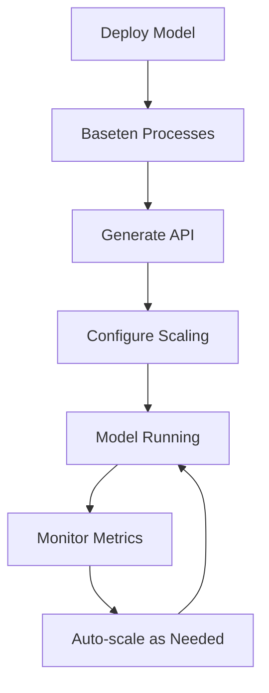

**Category:** AI Model Hosting Platforms
**Difficulty:** Intermediate
**Reading time:** 6 min read

---

Baseten is a platform designed specifically for deploying and scaling machine learning models in production. It provides simplified model serving with built-in autoscaling, monitoring, and optimization features for various model types and frameworks.

- **Model-agnostic serving** — Support for diverse model types and frameworks
- **Production-ready** — Features built for reliable, scalable deployments
- **API generation** — Automatic REST API creation from model code
- **Resource optimization** — Intelligent allocation of compute resources
- **Version management** — Easy model versioning and A/B testing

Baseten simplifies model deployment by handling the infrastructure complexity automatically. You provide your model and prediction code, and Baseten creates a production-ready API endpoint. The platform automatically scales based on traffic, spinning up additional container replicas during demand spikes and scaling down during quiet periods. Built-in monitoring tracks latency, throughput, error rates, and resource utilization. Models are versioned, allowing you to deploy new versions and gradually shift traffic. Baseten handles request queuing when overloaded and provides detailed performance metrics and alerts. Billing is based on compute time, with pricing for different GPU tiers.

- Deploying TensorFlow and PyTorch models to production
- Computer vision inference services
- NLP model serving at scale
- Real-time predictions requiring low latency
- Batch processing with automatic scaling

| Advantage | Disadvantage |
|-----------|--------------|
| Simplified model deployment process | Less control over infrastructure |
| Built-in autoscaling and monitoring | Vendor lock-in to Baseten platform |
| Automatic API generation | Limited customization of deployment |
| Cost-effective resource utilization | Potential latency from platform overhead |
| Easy model versioning and A/B testing | Learning curve for platform specifics |

- [Baseten autoscaling](baseten-autoscaling.md)
- [Baseten model monitoring](baseten-model-monitoring.md)
- [Ray Serve model serving](ray-serve-model-serving.md)

---
*Part of the [AI Model Hosting Platforms](index.md) category · [Back to Master Index](../../index.md)*
