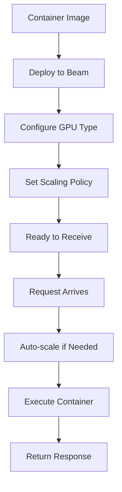

**Category:** AI Model Hosting Platforms
**Difficulty:** Intermediate
**Reading time:** 6 min read

---

Beam Cloud is a serverless GPU platform providing simple deployment of containerized workloads with automatic scaling. It focuses on making GPU compute accessible through straightforward abstractions and transparent pricing.

- **Serverless containers** — Deploy containers without managing infrastructure
- **Auto-scaling** — Automatic adjustment based on demand
- **GPU flexibility** — Choose from multiple GPU types for different workloads
- **Task queues** — Asynchronous job processing for batch workloads
- **Cost transparency** — Clear pricing per GPU minute

Beam deploys containerized applications and automatically handles scaling, load balancing, and resource allocation. When you deploy, Beam pulls your container image and configures it to run on specified GPU hardware. Incoming requests trigger container execution, with Beam scaling the number of concurrent containers based on queue depth and latency. Containers that are idle for extended periods are terminated to reduce costs. The platform integrates with object storage for data input/output. Task queues enable asynchronous processing of long-running jobs. Beam provides usage metrics and logs for debugging and optimization.

- On-demand model inference with variable traffic
- Batch processing of images or documents
- Data processing pipelines with GPU acceleration
- Rapid prototyping of GPU-based applications
- Cost-effective inference for unpredictable workloads

| Advantage | Disadvantage |
|-----------|--------------|
| Simple container-based deployment | Cold starts on first request |
| Automatic scaling without configuration | Limited customization options |
| Transparent per-minute pricing | Less sophisticated monitoring than some platforms |
| Supports long-running background tasks | Webhook complexity for async operations |
| Easy integration with standard tools | Platform-specific abstractions needed |

- [Beam task queues](beam-task-queues.md)
- [RunPod serverless GPU pods](runpod-serverless-gpu-pods.md)
- [Google Cloud Functions](../cloud-platforms/google-cloud-functions.md)

---
*Part of the [AI Model Hosting Platforms](index.md) category · [Back to Master Index](../../index.md)*
