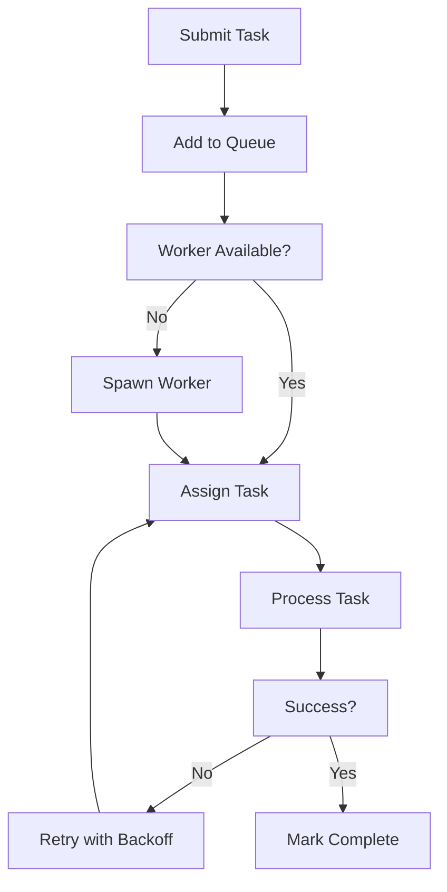

**Category:** AI Model Hosting Platforms
**Difficulty:** Intermediate
**Reading time:** 6 min read

---

Beam task queues provide asynchronous job processing for long-running workloads. They decouple request submission from processing, enabling efficient resource utilization and reliability for batch operations.

- **Task submission** — Queuing jobs for asynchronous processing
- **Worker pool** — Configurable number of workers processing tasks
- **Retry logic** — Automatic retry of failed tasks with exponential backoff
- **Status tracking** — Monitoring task progress and completion
- **Scale-to-zero** — Workers spin down when task queue is empty

Applications submit tasks to Beam's queue with job specifications and parameters. The queue buffers tasks and distributes them to available workers. Workers execute the task code in containerized environments, processing data and returning results. If a worker fails, Beam automatically retries the task with configurable retry policies. Task status is trackable throughout the pipeline, allowing applications to poll for completion. Failed tasks can be retried automatically or manually. Workers scale up when queue depth increases and scale down to zero when idle. Results are stored in object storage or returned via webhooks.

- Batch image or video processing jobs
- Long-running model inference operations
- Data transformation and ETL pipelines
- Report generation or export operations
- Asynchronous notification systems

| Advantage | Disadvantage |
|-----------|--------------|
| Decouples request from processing | Added latency from queueing |
| Efficient resource utilization | Complexity in error handling |
| Automatic scaling of worker pool | Limited task size constraints |
| Reliable execution with retries | Status polling overhead |
| Cost-effective for batch workloads | Requires webhook for result notification |

- [Beam cloud serverless GPU](beam-cloud-serverless-gpu.md)
- [Upstash Kafka serverless](../database-as-a-service-dbaas/upstash-kafka-serverless.md)
- [Apache Airflow workflow orchestration](../business-process-management-bpm/apache-airflow-workflow-orchestration.md)

---
*Part of the [AI Model Hosting Platforms](index.md) category · [Back to Master Index](../../index.md)*
