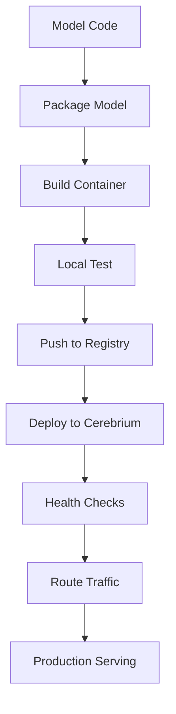

**Category:** AI Model Hosting Platforms
**Difficulty:** Intermediate
**Reading time:** 6 min read

---

Cerebrium model deployment provides tools and workflows for packaging, testing, and deploying ML models to production. The platform streamlines the entire deployment lifecycle from development to monitoring.

- **Model packaging** — Preparing models for containerized deployment
- **Local testing** — Validating models before cloud deployment
- **Deployment pipeline** — Automated steps from code to production
- **Environment configuration** — Managing dependencies and runtime settings
- **Rollback capability** — Reverting to previous model versions

Cerebrium's deployment process begins with packaging your model and dependencies into a container. You define entry points and dependencies in configuration files. The platform provides a CLI tool that builds and tests containers locally before pushing to Cerebrium's registry. During deployment, Cerebrium validates the container, allocates resources, and routes requests. The platform monitors container health and automatically replaces unhealthy instances. Model versions are tracked, allowing you to switch between versions or implement canary deployments. Detailed deployment logs help diagnose issues. Integration with version control systems enables automated deployments on code changes.

- Deploying PyTorch and TensorFlow models to production
- Reproducible model serving across environments
- Team collaboration on model deployments
- Automated model updates from continuous integration
- Model versioning and A/B testing

| Advantage | Disadvantage |
|-----------|--------------|
| Straightforward deployment workflow | Requires Docker knowledge |
| Local testing reduces deployment surprises | Limited integrated monitoring |
| Version control for model changes | Container size impacts cold start time |
| Automated deployments available | Manual configuration of dependencies |
| Reproducible deployments across teams | Limited built-in optimization |

- [Cerebrium serverless GPU](cerebrium-serverless-gpu.md)
- [Docker container fundamentals](../dev-tools/docker-container-fundamentals.md)
- [BentoML agent packaging](../ai-agent-hosting-deployment/bentoml-agent-packaging.md)

---
*Part of the [AI Model Hosting Platforms](index.md) category · [Back to Master Index](../../index.md)*
