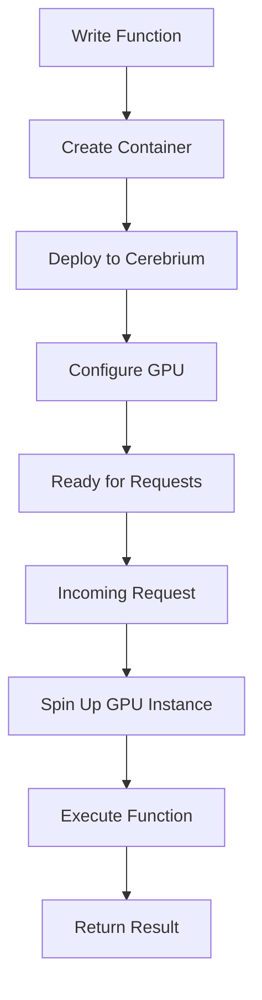

**Category:** AI Model Hosting Platforms
**Difficulty:** Intermediate
**Reading time:** 6 min read

---

Cerebrium provides serverless GPU infrastructure designed for ML model inference and batch processing. The platform offers simple containerization, automatic scaling, and straightforward pricing for on-demand compute without infrastructure management.

- **Containerized functions** — Deployment via container images with automatic scaling
- **GPU on-demand** — Access to GPUs without provisioning infrastructure
- **Ephemeral compute** — Functions that scale to zero when not in use
- **Request-based pricing** — Pay only for actual function invocations
- **Webhook support** — Asynchronous function triggering for batch workloads

With Cerebrium, you package your model serving code in a Docker container and deploy it. The platform handles spinning up GPU instances when requests arrive and scaling to zero when idle. Each request is executed in a containerized environment with your specified GPU type. Cerebrium manages the full lifecycle: scaling up during traffic spikes, maintaining warm containers during steady load, and terminating containers during idle periods. You configure minimum and maximum replica counts. The platform integrates with webhooks for asynchronous processing and supports batch jobs that process multiple items per invocation. Billing is per-second of GPU usage, with pricing based on GPU type.

- ML inference endpoints with variable traffic patterns
- Batch image or video processing
- On-demand model serving for research
- Prototyping ML-based APIs before migration
- Cost-sensitive inference workloads

| Advantage | Disadvantage |
|-----------|--------------|
| Simple deployment with Docker containers | Cold starts on first request |
| Pay only for actual usage | Limited control over scaling behavior |
| Automatic scaling without configuration | Less feature-rich than platforms like Kubernetes |
| Good for variable workloads | Webhook complexity for async processing |
| Straightforward pricing model | Limited monitoring and debugging tools |

- [Cerebrium model deployment](cerebrium-model-deployment.md)
- [RunPod serverless GPU pods](runpod-serverless-gpu-pods.md)
- [AWS Lambda serverless](../cloud-platforms/aws-lambda-serverless.md)

---
*Part of the [AI Model Hosting Platforms](index.md) category · [Back to Master Index](../../index.md)*
