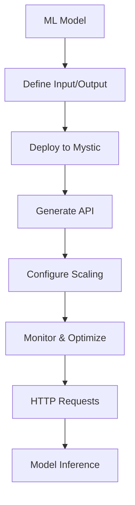

**Category:** AI Model Hosting Platforms
**Difficulty:** Intermediate
**Reading time:** 6 min read

---

Mystic AI provides a platform for deploying machine learning models with emphasis on simplicity and scalability. It enables developers to serve models through REST APIs without complex infrastructure management.

- **HTTP API generation** — Automatic REST API creation from model code
- **Deployment simplicity** — Minimal configuration required for deployment
- **Auto-scaling infrastructure** — Automatic resource allocation based on demand
- **Model versioning** — Easy management of multiple model versions
- **Integration support** — Connects with popular ML frameworks and tools

With Mystic AI, you provide your model code and define input/output specifications. The platform automatically generates a production-ready REST API. When deployed, Mystic handles infrastructure provisioning, auto-scaling based on traffic, and request routing. The platform manages model loading, inference execution, and response formatting. You can deploy multiple model versions and gradually shift traffic between them. Mystic provides dashboards for monitoring performance, latency, and resource utilization. Built-in authentication and rate limiting protect your API. Integration with CI/CD pipelines enables automated deployments.

- Serving TensorFlow and PyTorch models in production
- Building ML-powered APIs for applications
- Real-time predictions with variable demand
- Microservices architecture with model components
- Experimentation with model versions

| Advantage | Disadvantage |
|-----------|--------------|
| Simple deployment with minimal configuration | Limited control over infrastructure |
| Automatic API generation saves time | Vendor lock-in to Mystic platform |
| Easy model versioning and switching | Performance overhead from platform abstraction |
| Auto-scaling without manual management | Less flexible for complex workflows |
| Integration with popular frameworks | Learning curve for platform specifics |

- [Baseten model serving platform](baseten-model-serving-platform.md)
- [Steamship model packaging](steamship-model-packaging.md)
- [Google Cloud Run](../cloud-platforms/google-cloud-run.md)

---
*Part of the [AI Model Hosting Platforms](index.md) category · [Back to Master Index](../../index.md)*
