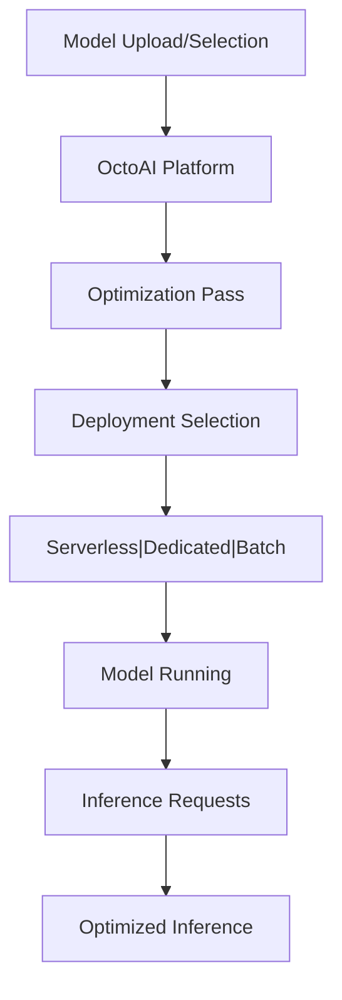

**Category:** AI Model Hosting Platforms
**Difficulty:** Intermediate
**Reading time:** 6 min read

---

OctoAI provides serverless inference compute specifically optimized for running generative AI models. The platform combines flexible deployment options with strong performance optimizations, enabling cost-effective model serving at scale.

- **Optimized inference** — Hardware and software tuning for LLMs and diffusion models
- **Flexible deployment** — Serverless API, dedicated endpoints, or batch processing
- **Model optimization** — Automatic techniques to improve inference speed
- **Token pricing** — Cost model based on input and output tokens
- **Multi-region availability** — Global deployment for low-latency access

OctoAI optimizes models for inference through techniques like quantization, knowledge distillation, and operator fusion. When you deploy a model, the platform analyzes it and applies optimizations to reduce latency and memory usage. You choose between serverless API endpoints for variable traffic, dedicated endpoints for consistent load, or batch processing for asynchronous workloads. The platform scales infrastructure automatically based on demand. Requests are routed through OctoAI's global network to the nearest data center. Billing is transparent and based on actual token consumption, with different pricing tiers for different model sizes and optimization levels.

- Production inference for LLMs with cost optimization
- Real-time image generation API services
- Multi-modal models combining text and vision
- Cost-sensitive inference at scale
- Latency-critical applications requiring optimization

| Advantage | Disadvantage |
|-----------|--------------|
| Strong performance optimizations reduce latency | Optimizations may introduce complexity |
| Transparent token-based pricing | Less control than self-hosted inference |
| Serverless option eliminates infrastructure management | Dependent on provider uptime |
| Multi-region availability for global deployment | Limited to models compatible with optimization |
| Automatic scaling without configuration | Potential bottlenecks during extreme load |

- [OctoAI model optimization](octoai-model-optimization.md)
- [Together.ai inference platform](togetherai-inference-platform.md)
- [Ray Serve model serving](ray-serve-model-serving.md)

---
*Part of the [AI Model Hosting Platforms](index.md) category · [Back to Master Index](../../index.md)*
