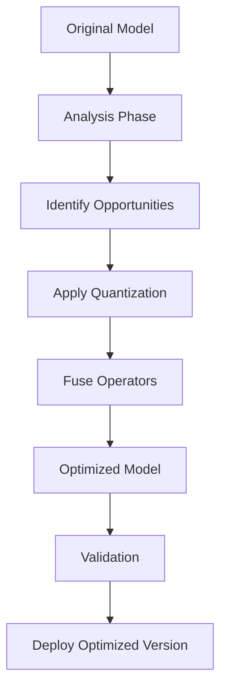

**Category:** AI Model Hosting Platforms
**Difficulty:** Advanced
**Reading time:** 7 min read

---

OctoAI's model optimization techniques automatically improve inference speed and reduce resource consumption without code changes. These optimizations enable serving larger models more cost-effectively while maintaining quality.

- **Quantization** — Reducing numerical precision from FP32 to lower precisions
- **Knowledge distillation** — Transferring knowledge to smaller models
- **Operator fusion** — Combining multiple operations into single optimized kernels
- **Memory optimization** — Reducing peak memory usage during inference
- **Latency profiling** — Identifying optimization opportunities

OctoAI analyzes model architectures to identify optimization opportunities. Quantization converts float32 weights to lower precisions like int8 or float16, reducing model size and memory bandwidth. This speeds up computation while typically maintaining accuracy through calibration on sample data. Operator fusion combines multiple computation steps (like linear + activation) into single optimized operations reducing memory transfers. Memory optimization techniques reorder computations to minimize peak memory requirements. The platform profiles the optimized model on target hardware and validates that optimizations don't degrade output quality. You can control optimization aggressiveness, balancing speed gains against potential accuracy loss.

- Reducing inference latency for time-sensitive applications
- Fitting larger models into memory-constrained environments
- Decreasing compute costs through efficient operations
- Serving multiple models with limited GPU memory
- Deploying models on edge devices

| Advantage | Disadvantage |
|-----------|--------------|
| Automated optimization requires no code changes | Potential accuracy loss with aggressive optimization |
| Significant latency improvements possible | Optimization process adds deployment time |
| Works across different model architectures | Limited customization of optimization strategy |
| Transparent process with benchmarking | Model compatibility varies across techniques |
| Cost savings from reduced compute | Requires validation after optimization |

- [OctoAI compute service](octoai-compute-service.md)
- [Product Quantization (PQ)](../vector-search-algorithms/product-quantization-pq.md)
- [Ray Serve model serving](ray-serve-model-serving.md)

---
*Part of the [AI Model Hosting Platforms](index.md) category · [Back to Master Index](../../index.md)*
