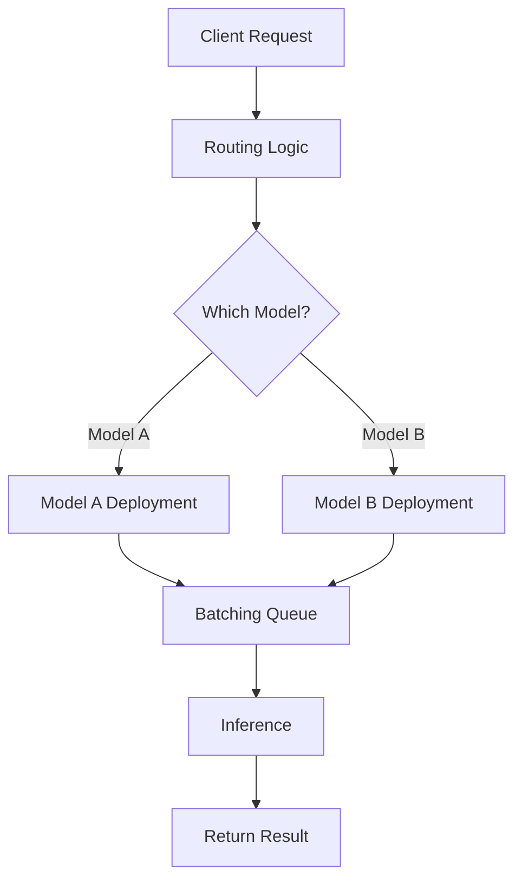

**Category:** AI Model Hosting Platforms
**Difficulty:** Advanced
**Reading time:** 7 min read

---

Ray Serve is a scalable model serving framework built on Ray that enables deploying multiple models with complex routing logic. It handles batching, versioning, and scale-to-zero optimization for cost-effective inference.

- **Model deployments** — Individual serving units for models
- **Routing logic** — Complex request routing between models
- **Batching** — Efficient processing of multiple requests together
- **Model versioning** — Gradual traffic shifting between versions
- **Auto-scaling** — Scaling based on demand without manual intervention

Ray Serve provides Python APIs for defining model deployments. Each deployment is an independent serving unit that can scale. You define routing logic to determine which deployment handles each request. Requests are batched when possible for efficiency. Deployments scale up when queue depth increases and scale down during low traffic. Ray Serve supports model versioning, allowing you to gradually shift traffic between versions. The framework handles HTTP request parsing, response serialization, and error handling. Deployments can depend on each other, enabling multi-stage inference pipelines.

- Serving multiple models with intelligent routing
- Ensemble models combining predictions
- Progressive model rollouts and A/B testing
- Scaling diverse model types independently
- Complex inference pipelines with multiple stages

| Advantage | Disadvantage |
|-----------|--------------|
| Sophisticated routing and batching logic | Requires Ray expertise |
| Flexible model organization | Complex debugging in distributed setting |
| Efficient resource utilization | Setup complexity for simple cases |
| Built-in versioning and canary deployments | Limited to Ray ecosystem |
| Scale-to-zero reduces idle costs | Cold start latency when scaling up |

- [Ray Train distributed training](ray-train-distributed-training.md)
- [Anyscale Ray platform](anyscale-ray-platform.md)
- [Baseten model serving platform](baseten-model-serving-platform.md)

---
*Part of the [AI Model Hosting Platforms](index.md) category · [Back to Master Index](../../index.md)*
