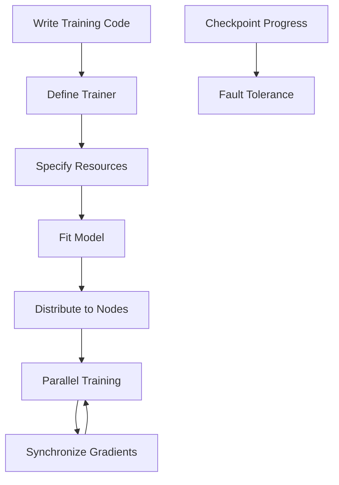

**Category:** AI Model Hosting Platforms
**Difficulty:** Advanced
**Reading time:** 7 min read

---

Ray Train is a distributed training framework that abstracts away complexity of multi-GPU and multi-node training. It enables scaling model training across machines while maintaining simple, familiar Python APIs.

- **Distributed training** — Scaling training across multiple GPUs and machines
- **Framework integration** — Works with PyTorch, TensorFlow, Hugging Face
- **Automatic fault tolerance** — Handles node failures with checkpointing
- **Resource abstraction** — Simplified resource specification and allocation
- **Hyperparameter tuning** — Integration with Ray Tune for optimization

Ray Train abstracts distributed training complexity through high-level APIs. You write training code using your preferred framework (PyTorch, TensorFlow) almost unchanged. Ray Train handles data sharding across workers, gradient synchronization, and communication. When you specify resources, Ray allocates GPUs across available machines and launches training. Ray automatically handles distributed data loading, checkpoint saving, and metric reporting. If a worker fails, Ray can resume from the last checkpoint. Ray Train integrates with Ray Tune for hyperparameter optimization, enabling distributed tuning of training parameters. Results are collected and aggregated across workers.

- Scaling large model training to multiple GPUs
- Multi-node training on cloud infrastructure
- Hyperparameter optimization with distributed trials
- Fine-tuning pre-trained models efficiently
- Batch training of multiple model variants

| Advantage | Disadvantage |
|-----------|--------------|
| Simplifies distributed training significantly | Requires learning Ray APIs |
| Fault tolerance with checkpointing | Debugging distributed training is complex |
| Framework-agnostic approach | Potential communication overhead |
| Integrates with Ray Tune for optimization | Setup complexity for simple training |
| Handles resource management automatically | Lock-in to Ray ecosystem |

- [Anyscale Ray platform](anyscale-ray-platform.md)
- [Ray Serve model serving](ray-serve-model-serving.md)
- [Together.ai fine-tuning service](togetherai-fine-tuning-service.md)

---
*Part of the [AI Model Hosting Platforms](index.md) category · [Back to Master Index](../../index.md)*
