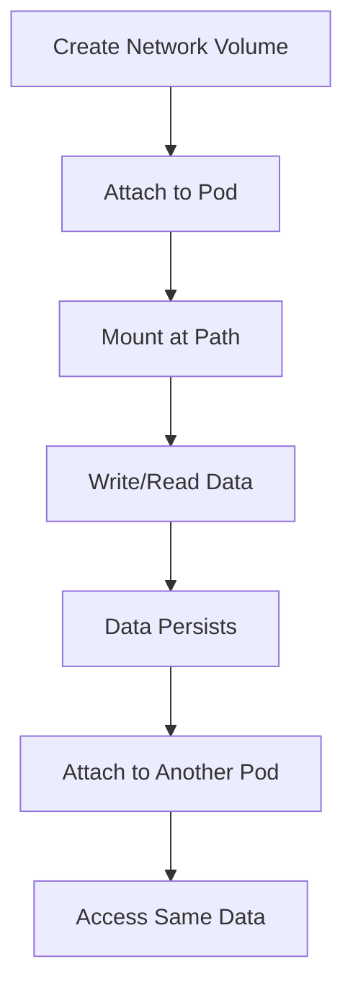

**Category:** AI Model Hosting Platforms
**Difficulty:** Intermediate
**Reading time:** 6 min read

---

RunPod network volumes are persistent storage that can be attached to pods, allowing data to survive pod termination and be shared across multiple pods. They provide fast network storage accessible from compute resources without downloading models repeatedly.

- **Network attached storage (NAS)** — Persistent storage accessible over network
- **Pod attachment** — Volumes that mount to running pods as filesystem paths
- **Data persistence** — Storage survives pod termination and restart
- **Multi-pod sharing** — Volume accessible by multiple pods simultaneously
- **Storage regions** — Volumes located in specific data centers for latency optimization

Network volumes are persistent storage resources created in your RunPod account and attached to pods as mount points. Unlike container storage which is ephemeral, network volumes remain after a pod terminates. Multiple pods can access the same volume simultaneously, enabling shared datasets or distributed processing. Volumes are stored in regional data centers and accessed over high-speed network connections, providing performance between local disk and cloud storage. You specify the volume size, region, and which pods mount it. Data is charged separately from compute, with pricing based on stored capacity and monthly usage.

- Storing large model weights shared across multiple pods
- Persistent dataset storage for training pipelines
- Shared cache for inference acceleration
- Backup storage for pod outputs
- Dataset versioning and management

| Advantage | Disadvantage |
|-----------|--------------|
| Persistent storage across pod restarts | Additional storage costs beyond compute |
| Shared access from multiple pods | Network latency vs. local disk |
| Survives pod termination | Must manage volume lifecycle separately |
| Fast network access | Regional limitations based on data center |
| Cost-effective for large models | Potential bottleneck for high-throughput access |

- [RunPod persistent pods](runpod-persistent-pods.md)
- [AWS EBS storage options](../cloud-platforms/aws-ebs-storage-options.md)
- [AWS S3 storage classes](../cloud-platforms/aws-s3-storage-classes.md)

---
*Part of the [AI Model Hosting Platforms](index.md) category · [Back to Master Index](../../index.md)*
