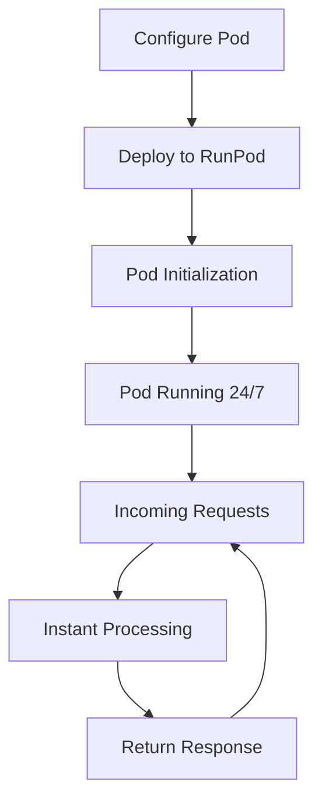

**Category:** AI Model Hosting Platforms
**Difficulty:** Intermediate
**Reading time:** 6 min read

---

RunPod persistent pods are long-running compute instances that remain active continuously, providing dedicated GPU resources. They're ideal for applications requiring low-latency access or continuous availability without cold-start delays.

- **Persistent deployment** — Long-lived pods that stay running between requests
- **Dedicated GPUs** — Exclusive access to GPU resources without sharing
- **Fixed billing** — Predictable hourly costs regardless of usage patterns
- **Warm starts** — Immediate request handling without initialization delays
- **State persistence** — Ability to maintain application state across requests

Persistent pods run continuously on RunPod infrastructure, providing dedicated GPU compute resources. You specify the pod size (GPU type and quantity), container image, and any environment configuration. The pod launches and remains active, ready to handle requests immediately without initialization overhead. Billing is calculated hourly regardless of actual usage, making it predictable for production services. The pod maintains its state between requests, allowing you to load models once during startup and reuse them efficiently. Network connectivity is provided through either HTTP endpoints or direct networking options. You can scale by running multiple pods behind a load balancer.

- Production API endpoints requiring consistent low latency
- WebSocket services for real-time interactions
- Services with continuous background tasks
- Training pipelines that run continuously
- Applications requiring state maintenance between requests

| Advantage | Disadvantage |
|-----------|--------------|
| No cold starts - instant response times | Costs accumulate whether pod is used or not |
| Full control over pod environment | Scaling requires managing multiple pods |
| Persistent state between requests | Less flexibility than serverless models |
| Dedicated GPU resources | Fixed costs regardless of demand |
| Always-on availability | Over-provisioning can be wasteful |

- [RunPod serverless GPU pods](runpod-serverless-gpu-pods.md)
- [RunPod template marketplace](runpod-template-marketplace.md)
- [AWS ECS container service](../cloud-platforms/aws-ecs-container-service.md)

---
*Part of the [AI Model Hosting Platforms](index.md) category · [Back to Master Index](../../index.md)*
