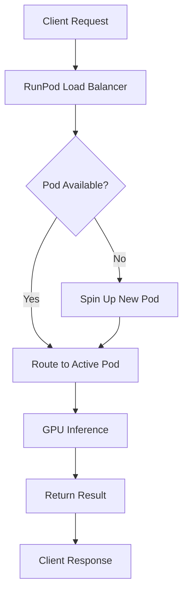

**Category:** AI Model Hosting Platforms
**Difficulty:** Intermediate
**Reading time:** 6 min read

---

RunPod serverless GPU pods provide on-demand compute resources that scale automatically based on request volume. They allow developers to run inference workloads without managing infrastructure, paying only for actual compute time consumed.

- **Serverless computing** — Event-driven execution model where infrastructure is managed automatically
- **GPU pods** — Containerized compute environments with GPU acceleration for ML inference
- **Cold starts** — Initial latency when spinning up a pod to handle a request
- **Autoscaling** — Automatic adjustment of pod instances based on traffic demand
- **Request queuing** — Buffering of incoming requests when pods are at capacity

RunPod serverless GPU pods operate through an event-driven architecture. When a request arrives, the load balancer checks for available pods. If none exist or all are busy, new pods spin up automatically. Each pod is a containerized environment that can run your custom inference code. The pods execute the workload on available GPUs and return results. Billing is calculated per-second of actual compute time, plus any time spent in the request queue. Cold starts typically add 30-60 seconds on first invocation, but subsequent requests can reuse warm pods if within the keep-alive window. The platform handles all scaling, networking, and resource allocation automatically.

- Real-time image generation with Stable Diffusion or DALL-E models
- Video processing pipelines with variable load patterns
- Batch inference jobs that need automatic scaling
- API endpoints for ML model predictions
- Batch processing of large datasets with intermittent bursts

| Advantage | Disadvantage |
|-----------|--------------|
| No infrastructure management required | Cold starts add latency to first requests |
| Pay only for compute time used | Less control over GPU selection |
| Automatic scaling to handle traffic spikes | Batch size limitations compared to persistent pods |
| Simple deployment via container images | Potential request queueing during high demand |
| Cost-effective for variable workloads | Limited customization of pod environment |

- [RunPod persistent pods](runpod-persistent-pods.md)
- [RunPod network volumes](runpod-network-volumes.md)
- [AWS Lambda serverless](../cloud-platforms/aws-lambda-serverless.md)

---
*Part of the [AI Model Hosting Platforms](index.md) category · [Back to Master Index](../../index.md)*
