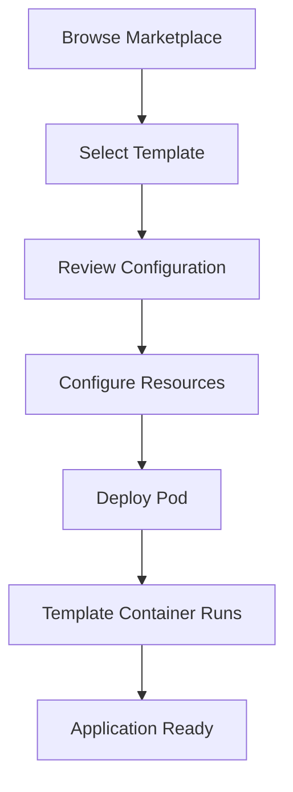

**Category:** AI Model Hosting Platforms
**Difficulty:** Beginner
**Reading time:** 5 min read

---

RunPod's template marketplace provides pre-configured container images and deployment templates for popular AI models and frameworks. Templates accelerate deployment by bundling dependencies, model weights, and runtime configurations into ready-to-use containers.

- **Container templates** — Pre-built Docker images with all dependencies installed
- **One-click deployment** — Launch complex applications without building images
- **Community templates** — Templates created and shared by the RunPod community
- **Model bundling** — Templates that include pre-downloaded model weights
- **Custom templates** — Option to create and share your own templates

The RunPod template marketplace provides a curated collection of container images for popular AI models and applications. Each template includes the base framework (PyTorch, TensorFlow, etc.), necessary dependencies, and often pre-downloaded model weights. When deploying from a template, RunPod automatically pulls the image and launches it in your pod with your specified configuration. Templates reduce deployment time from hours to minutes, eliminate dependency issues, and provide consistent environments. You can customize environment variables, resource allocation, and other parameters before deploying. The marketplace also allows you to create and publish your own templates for community use.

- Quick prototyping of new AI models
- Deploying popular models like Llama, Mistral, or Stable Diffusion
- Learning different frameworks without setup complexity
- Creating consistent development environments
- Sharing model deployments with colleagues

| Advantage | Disadvantage |
|-----------|--------------|
| Dramatically speeds up deployment | Templates may include unnecessary components |
| Eliminates dependency resolution issues | Limited customization vs. custom images |
| Pre-downloaded model weights save time | Marketplace templates may be outdated |
| Community-maintained options reduce cost | Reliance on third-party template quality |
| Great learning resource for new tools | Potential security considerations with community templates |

- [RunPod serverless GPU pods](runpod-serverless-gpu-pods.md)
- [Hugging Face Spaces for agents](../ai-agent-hosting-deployment/hugging-face-spaces-for-agents.md)
- [Docker container fundamentals](../dev-tools/docker-container-fundamentals.md)

---
*Part of the [AI Model Hosting Platforms](index.md) category · [Back to Master Index](../../index.md)*
