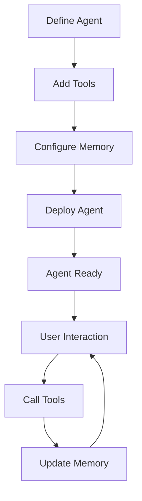

**Category:** AI Model Hosting Platforms
**Difficulty:** Intermediate
**Reading time:** 6 min read

---

Steamship agent hosting provides infrastructure for deploying AI agents with built-in support for tool integration, memory management, and multi-turn interactions. It's designed specifically for agent applications requiring state persistence and plugin architecture.

- **Agent framework** — Standardized interface for agent development
- **Tool integration** — Connecting agents to external APIs and services
- **Persistent memory** — State management across interactions
- **Plugin system** — Extensible agent capabilities
- **Deployment scaling** — Automatic scaling for agent workloads

Steamship provides a framework for building agents with clear abstraction for tools, memory, and interactions. You define your agent by specifying the base model, available tools, and memory strategy. Tools are external APIs and services your agent can call. Memory stores conversation history and extracted facts. When deployed, agents scale automatically based on concurrent user sessions. Each session maintains independent state and memory. The platform handles authentication, session management, and logging. Agents respond to messages and internally orchestrate tool calls and memory updates.

- Conversational agents with tool access
- Customer support bots with context awareness
- Research assistants with internet access
- Personal AI assistants with persistent knowledge
- Domain-specific agents with specialized tools

| Advantage | Disadvantage |
|-----------|--------------|
| Built-in agent abstractions simplify development | Requires adopting Steamship framework |
| Automatic state and memory management | Less flexibility than custom implementations |
| Tool integration is streamlined | Platform-specific patterns needed |
| Scales automatically for concurrent agents | Learning curve for best practices |
| Production-ready deployment included | Limited to Steamship ecosystem |

- [Steamship model packaging](steamship-model-packaging.md)
- [LangChain LangServe deployment](../ai-agent-hosting-deployment/langchain-langserve-deployment.md)
- [Chainlit conversational AI UI](../ai-agent-hosting-deployment/chainlit-conversational-ai-ui.md)

---
*Part of the [AI Model Hosting Platforms](index.md) category · [Back to Master Index](../../index.md)*
