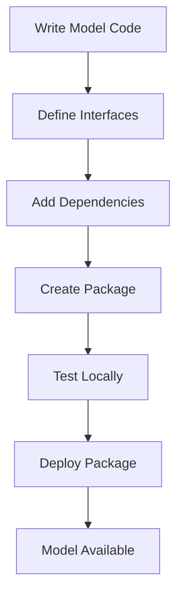

**Category:** AI Model Hosting Platforms
**Difficulty:** Intermediate
**Reading time:** 6 min read

---

Steamship provides tools for packaging machine learning models and agents into production-ready packages. It simplifies the process of preparing models for deployment with standardized interfaces and lifecycle management.

- **Model packages** — Containerized, self-contained model deployments
- **Plugin architecture** — Extensible model components for specialized tasks
- **Lifecycle hooks** — Initialization and cleanup code management
- **Dependency management** — Simplified handling of model requirements
- **Versioning** — Built-in model version tracking

Steamship provides Python libraries and decorators for packaging models. You annotate model methods to define API endpoints and dependencies. The framework handles serialization, error handling, and request routing. When you package a model, Steamship bundles dependencies and creates a deployable artifact. The framework provides lifecycle hooks for initialization (loading model weights) and cleanup. Models are versioned automatically, allowing you to track changes. Steamship handles scaling, resource allocation, and monitoring automatically. You can integrate custom components like vector stores or external APIs.

- Packaging language models for deployment
- Creating production-ready chatbot packages
- Bundling complex model pipelines
- Sharing models across teams
- Building modular AI applications

| Advantage | Disadvantage |
|-----------|--------------|
| Standardized packaging simplifies deployment | Requires learning Steamship framework |
| Built-in lifecycle management | Less flexibility than custom solutions |
| Easy versioning and updates | Platform dependencies in codebase |
| Integration with Steamship ecosystem | Learning curve for best practices |
| Reduces deployment complexity | Limited to Steamship platform |

- [Steamship agent hosting](steamship-agent-hosting.md)
- [BentoML agent packaging](../ai-agent-hosting-deployment/bentoml-agent-packaging.md)
- [Docker container fundamentals](../dev-tools/docker-container-fundamentals.md)

---
*Part of the [AI Model Hosting Platforms](index.md) category · [Back to Master Index](../../index.md)*
