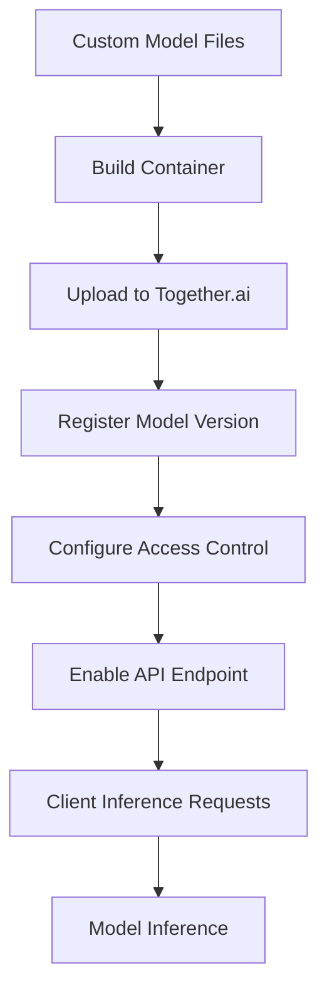

**Category:** AI Model Hosting Platforms
**Difficulty:** Advanced
**Reading time:** 6 min read

---

Together.ai custom models allow organizations to deploy proprietary or fine-tuned models on the Together.ai infrastructure. This enables serving custom models with the same API simplicity and scalability as public models while maintaining control over model access and versions.

- **Model upload** — Process for deploying custom model files to platform
- **Version control** — Managing multiple versions of custom models
- **Access control** — Restricting model access to authorized users/teams
- **Model routing** — API calls directed to custom model endpoints
- **Integration** — Custom models work with Together.ai API and features

To deploy a custom model on Together.ai, you package your model in a supported format and container configuration. Together.ai hosts the model on its infrastructure and exposes it through the standard Together.ai API. You can maintain multiple versions and control which versions are active. The platform handles scaling, load balancing, and resource allocation for your custom model. Access can be restricted to specific users, teams, or made public. Usage billing tracks compute usage separately for custom models, allowing you to understand costs of serving proprietary models.

- Serving fine-tuned language models for specialized domains
- Commercial models with proprietary enhancements
- Internal research models with collaborative access
- Custom models required for regulatory compliance
- Proprietary model variants with custom inference optimizations

| Advantage | Disadvantage |
|-----------|--------------|
| Leverages Together.ai infrastructure and scaling | Custom model maintenance responsibility |
| API compatibility with public models | Model optimization for platform may be needed |
| Version control and gradual rollouts | Ongoing support for model format compatibility |
| Simplified deployment vs. self-hosting | Storage and compute costs for models |
| Access control for proprietary models | Limited to models compatible with platform |

- [Together.ai inference platform](togetherai-inference-platform.md)
- [Together.ai fine-tuning service](togetherai-fine-tuning-service.md)
- [Baseten model serving platform](baseten-model-serving-platform.md)

---
*Part of the [AI Model Hosting Platforms](index.md) category · [Back to Master Index](../../index.md)*
