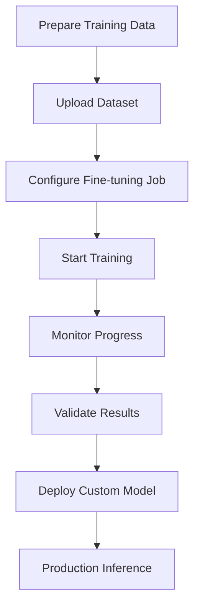

**Category:** AI Model Hosting Platforms
**Difficulty:** Advanced
**Reading time:** 7 min read

---

Together.ai's fine-tuning service enables organizations to adapt base models to specific domains or tasks using their own data. The platform handles the compute-intensive training process and creates custom models optimized for particular use cases.

- **Transfer learning** — Adapting pre-trained models to new tasks
- **Data preparation** — Formatting training data for fine-tuning jobs
- **Hyperparameter tuning** — Configuring learning rates, epochs, and other parameters
- **Training monitoring** — Tracking progress and metrics during fine-tuning
- **Model evaluation** — Testing fine-tuned models before deployment

Fine-tuning on Together.ai starts with preparing your training dataset in JSONL format. You upload the dataset and configure training parameters like learning rate, batch size, and number of epochs. Together.ai manages the training process on its infrastructure, automatically handling GPU allocation and distributed training if needed. During training, you can monitor loss curves and other metrics. Once training completes, the resulting custom model is available for inference through the Together.ai API. You can evaluate the model's performance before deployment and roll back to previous versions if needed. Pricing typically covers GPU compute hours used during training.

- Domain-specific chatbots (legal, medical, financial)
- Style adaptation for brand-specific language models
- Task-specific models (summarization, classification, code generation)
- Cost optimization by using smaller base models
- Creating specialized models for competitive advantage

| Advantage | Disadvantage |
|-----------|--------------|
| Faster optimization with managed infrastructure | Requires high-quality training data |
| Handles technical complexity of training | Training time adds to deployment cycle |
| Models available immediately after training | May require experimentation with hyperparameters |
| Support for large-scale fine-tuning | Costs accumulate during training runs |
| Easy evaluation and rollback | Data quality directly impacts model performance |

- [Together.ai inference platform](togetherai-inference-platform.md)
- [Together.ai custom models](togetherai-custom-models.md)
- [Ray Train distributed training](ray-train-distributed-training.md)

---
*Part of the [AI Model Hosting Platforms](index.md) category · [Back to Master Index](../../index.md)*
