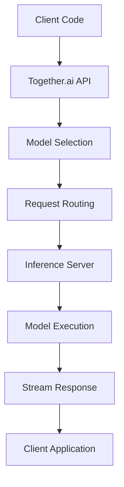

**Category:** AI Model Hosting Platforms
**Difficulty:** Intermediate
**Reading time:** 6 min read

---

Together.ai is an API-based inference platform providing access to hundreds of open-source language models and custom models. It offers competitive pricing, fast inference speeds, and support for both proprietary and open models through a unified interface.

- **Model marketplace** — Access to hundreds of pre-trained models via API
- **Unified API** — Single interface for accessing different model architectures
- **Batch inference** — Processing multiple requests efficiently
- **Custom models** — Ability to run proprietary or fine-tuned models
- **Cost optimization** — Competitive pricing with variable model costs

Together.ai provides a RESTful API for inference on language models. When you submit a request, it's routed to the appropriate inference server running your chosen model. The platform handles load balancing, scaling, and model management automatically. You specify parameters like temperature, max tokens, and sampling method just like the OpenAI API. Together.ai supports streaming responses for real-time applications and batch processing for high-volume inference. The platform manages model versions, allowing you to specify exact model versions or use recommended versions. Billing is per token, with pricing varying by model size and type.

- Production chatbot APIs using open-source models
- Cost-sensitive inference at scale
- Experimenting with different open models quickly
- Inference without managing your own GPU infrastructure
- Building applications with proprietary fine-tuned models

| Advantage | Disadvantage |
|-----------|--------------|
| Hundreds of models available via single API | Less control than self-hosted inference |
| Competitive pricing with transparent per-token costs | Dependent on provider availability |
| Easy switching between models | Limited customization of inference parameters |
| Scales automatically without management | Batch size and sequence length limitations |
| Supports streaming and batch modes | Privacy considerations with API-based inference |

- [Together.ai custom models](togetherai-custom-models.md)
- [Together.ai fine-tuning service](togetherai-fine-tuning-service.md)
- [Ray Serve model serving](../ai-model-hosting-platforms/ray-serve-model-serving.md)

---
*Part of the [AI Model Hosting Platforms](index.md) category · [Back to Master Index](../../index.md)*
