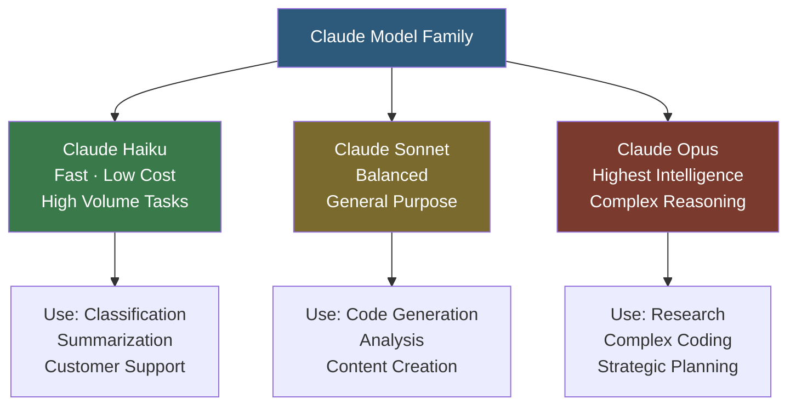

**Category:** AI Model Marketplaces
**Difficulty:** Beginner
**Reading time:** 5 min read

---

Anthropic's model catalog comprises the Claude family of large language models, accessible through the Anthropic API and integrated into major cloud platforms including AWS Bedrock and Google Cloud Vertex AI. The catalog is organized around capability tiers (Haiku, Sonnet, Opus) that trade cost and speed against intelligence, enabling developers to select the right model for each use case.

- **Claude model family** — Anthropic's LLM lineup including Haiku (fast/cheap), Sonnet (balanced), and Opus (most capable) variants
- **Constitutional AI** — Anthropic's training methodology that aligns model behavior using a set of principles, reducing harmful outputs
- **Extended thinking** — a Claude feature enabling multi-step reasoning with visible thought traces before the final response
- **Tool use** — Claude's function-calling capability for structured JSON output and external system integration
- **Prompt caching** — a Claude API feature that caches prefix tokens, reducing cost by up to 90% for repeated system prompts
- **Amazon Bedrock integration** — Anthropic's partnership making Claude available via AWS's managed AI service with enterprise SLAs

Anthropic's API follows a message-based format where requests include a `messages` array and an optional `system` prompt. Unlike OpenAI's chat completions which accept `role: system` within the messages array, Claude uses a separate `system` parameter, though the behavior is equivalent.

Prompt caching is activated by marking portions of the request with a `cache_control` block. Anthropic caches the first N tokens of a request (up to 200K tokens on Claude 3.5 models) for 5 minutes. Subsequent requests with identical prefixes pay only cache read tokens (10% of input cost) rather than full input tokens. This is particularly valuable for RAG systems that prepend large document contexts.

Extended thinking inserts a `<thinking>` block into responses where the model works through complex problems step by step before committing to a final answer. The thinking budget is configurable in tokens, and thinking content can be hidden from end users while still influencing response quality.

Claude is available through three channels: the direct Anthropic API (anthropic.com), AWS Bedrock (with AWS IAM authentication and VPC endpoint support), and Google Cloud Vertex AI (with GCP IAM integration). Enterprise contracts on Bedrock and Vertex include data processing agreements and guaranteed capacity.

- Using Claude Haiku for high-volume document classification at low cost per document
- Enabling extended thinking for a research assistant application requiring multi-step logical deduction
- Using prompt caching with a large system prompt to reduce API costs by 85% in a chatbot
- Deploying Claude via Bedrock to satisfy enterprise data residency requirements in AWS regions

| Advantage | Disadvantage |
|-----------|--------------|
| Prompt caching significantly reduces cost for repeated-prefix workloads | Model weights are proprietary; cannot be self-hosted on own infrastructure |
| Strong safety alignment reduces harmful output rates | Stricter safety training can refuse legitimate edge-case requests |
| Multiple deployment channels (direct API, Bedrock, Vertex) for compliance flexibility | Smaller model catalog than OpenAI; limited multimodal generation capabilities |

- [OpenAI Model Marketplace](openai-model-marketplace.md)
- [Model Usage Terms](model-usage-terms.md)
- [Model Safety Ratings](model-safety-ratings.md)

---
*Part of the [AI Model Marketplaces](index.md) category · [Back to Master Index](../../index.md)*
